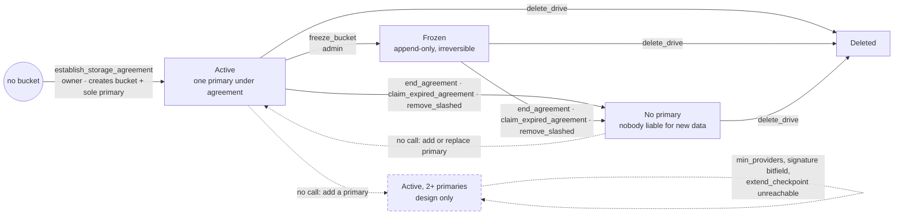

# Potential RFC: Bucket lifecycle and transfer between providers (Draft)

> **Draft — needs triage.** Gap summary for discussion with the design owner.
> No proposal. Written against `dev` at 7a9673c0 (2026-09-14).

## Story

A dApp operator owns bucket `B`. The dApp's users write into `B`. The operator
never had a local copy of the data and cannot ask the users to upload it
again.

`B` has one primary provider `P1` under a 1-year agreement. Before it expires,
`B` must continue on provider `P2`:

- same `bucket_id`, because DNS TXT / DotNS records, `bucket://` URIs, Layer 1
  drives, replica agreements, members and contracts all reference it, and the
  design promises "the bucket_id never changes";
- `P2` is a primary, because replicas are read-only and the dApp keeps
  writing;
- `P2` gets the data from `P1` or a replica, nobody re-uploads;
- the operator sees on chain that `P2` has the data before `P1` leaves.

**Today this is not possible.** The only way to put a second provider under
contract is `establish_storage_agreement`, which creates a new bucket. The
design describes multi-primary buckets ("Add 2-3 diverse providers") but
specifies no way to add a primary to an existing bucket, and the pallet has
none. Data movement between primaries is assigned to the client ("client
re-uploads"). Replicas sync automatically but cannot take writes.

## Bucket lifecycle (code on `dev`)

A Layer 0 bucket has four states. Only the transitions listed exist.

| State | Meaning |
|---|---|
| **Active** | One primary under agreement. Writes, checkpoints and challenges work. Replicas optional. |
| **Frozen** | Active, but append-only from the frozen snapshot. Irreversible. |
| **No primary** | The primary agreement ended. Bucket, members, snapshot and replica agreements remain. No provider can sign a checkpoint, so no new data is committed with anyone liable for it. Only replicas still under agreement are challengeable. (`set_min_providers(0)` is accepted in this state and lets `checkpoint` pass with no signatures at all, see *Drifts*.) |
| **Deleted** | Bucket and all agreements removed. |

| From | To | Call | Caller |
|---|---|---|---|
| — | Active | `establish_storage_agreement` | owner, redeeming provider-signed terms. Creates the bucket and its only primary in one step. |
| Active | Active | `establish_replica_agreement`, `extend_agreement`, `top_up_agreement`, `top_up_replica_sync_balance`, `set_member`, `remove_member`, `set_bucket_visibility`, `set_min_providers`, `checkpoint`, `extend_checkpoint` | owner / admin / writers |
| Active | Frozen | `freeze_bucket` | admin |
| Active, Frozen | No primary | `end_agreement` (early or after expiry) | owner, also admin if early |
| Active, Frozen | No primary | `claim_expired_agreement` (after `SettlementTimeout`) | provider |
| Active, Frozen | No primary | `remove_slashed` (provider stake is zero) | anyone |
| any | Deleted | `delete_drive` → `cleanup_bucket_internal`. Ends every agreement, replicas included, with prorated refunds. Refused while any agreement has a pending challenge. | drive owner who is bucket admin |

`deregister_provider` is rejected while the provider has active agreements, so
it is not a bucket transition. `delete_s3_bucket` removes the S3 registry
entry only; the Layer 0 bucket and its agreements remain.

Solid arrows are implemented on `dev`. Dashed arrows and the dashed state are
described in the design and have no extrinsic. In-state calls from the table
are left off to keep the drawing readable.

### Not implemented

- **Active with two or more primaries. Is this still the target?** The design
  describes multi-primary buckets, `min_providers`, the signature bitfield and
  `extend_checkpoint` for them. No call adds a second primary.
  `set_min_providers` exists but is capped by the primary count, so it can
  only hold 0 or 1 and that machinery is unreachable. If yes, the
  join path below is the missing piece and every item after it follows from
  it. If no, the design must say single primary plus replicas, and the
  transfer story reduces to replacing the one primary.
- **No primary → Active.** Nothing adds or replaces a primary. A bucket whose
  primary expired, ended or was slashed stays read-only forever under the same
  `bucket_id`. #403 removed the `ProviderAddedToBucket` event as dead code.
- **Replica → Primary.** A provider cannot hold both roles on one bucket and
  cannot be promoted.
- **Owner change.** `transfer_agreement_ownership` is in the design only.
  Open PR #414 implements it; it moves the payer, not the data.
- **Create without a provider.** The design has `create_bucket`; the code has
  none (#376 DRIFT-002).
- **Delete at Layer 0.** No extrinsic. A bucket not backed by a drive cannot be
  deleted.
- **Retention after expiry.** Challenges stop at the expiry block; there is no
  window in which a successor can fetch the data from a still-liable provider.

## Main questions

Grouped into six topics, in meeting order.

### 1. Bucket lifecycle

- **Bucket-level provider change.** Is it intended that a bucket moves to a
  new provider, or that a primary is added to an existing bucket? The
  design promises a stable `bucket_id` across providers and has no path to
  keep it.
- **Retention after expiry.** The provider may delete data at the expiry
  block; all challenges stop there. Should a retention period exist during
  which the provider stays challengeable, so a transfer has a window?
- **Renewal and notice.** Renewal needs a live, funded owner before the
  expiry block, and a provider can block extensions one block before it.
  Should there be auto-renew from escrow and a minimum notice period?

### 2. Multi-provider

Decide first whether multi-primary is still the target (see *Not
implemented*). If yes, the join path is the missing piece and the rest
follows. If no, the design should say single primary plus replicas, and
transfer reduces to replacing the one primary.

- **Provider-to-provider transfer.** Should a joining primary obtain the
  data from any provider under agreement on the bucket, the way replicas do,
  instead of the client re-uploading? (#65 §1, §4)
- **Liability of a joining primary.** A primary is slashable only for
  snapshots it signed, and only a writer/admin can add its signature. Should
  a primary attest possession itself? Is there a middle ground between
  "one signature is enough" and "all primaries must sign"?
- **Replica to primary.** Should a provider be replica and primary of one
  bucket at once, or be promoted in place, so a replica can serve as warm
  standby?

### 3. Incentives

The stake is a hold on the provider's balance and earns nothing while held,
so it forgoes relay staking yield for the life of the longest agreement. The
fee sits in the owner's escrow and is paid to the provider only at
settlement.

- **Capital cost of a 1-year primary.** Stake locked for a year with no
  yield, fee received at month 12. Acceptable, or should the fee stream or
  vest per checkpoint?
- **Nobody challenges.** A successful challenger gets a refund and no reward
  (design v2.1), and the provider node does not challenge. Who verifies a
  departing or joining primary?
- **Slash granularity.** One failed challenge slashes the entire global
  stake across all agreements, including while a provider winds down one
  bucket and serves others.
- **Overlap payment.** During a transfer both providers are paid for the
  same bytes and the bulk fetch is unpaid.

### 4. 1-year contract numbers

Fee = `price_per_byte × max_bytes × duration`, in integer plancks per byte
per anchor block. One year is 5,256,000 relay blocks. The whole fee is
escrowed upfront as a hold on the owner and paid out at settlement; early
end refunds `fee × remaining / total`. Paseo constants on `dev`:
`MinProviderStake` 1,000 UNIT, `MinStakePerByte` 1,000 plancks (1 UNIT per
GB), `SettlementTimeout` 24 relay hours, `ChallengeDeposit` 1 UNIT,
`max_duration` provider-set and unbounded by default.

- **Price granularity.** The smallest non-zero price is 1 planck per byte
  per block, so 1 GB for a year costs at least 5,256 UNIT while the stake
  backing that GB is 1 UNIT. A 100 GB bucket for a year escrows 525,600 UNIT
  on day one. Is zero pricing the intended default, or does the unit need to
  change (per GB-block, per byte-day, fixed-point price)?

### 5. dApp integration

- **dApp user data ownership.** One operator bucket (users as writers, a
  shared key, or a contract), one bucket per user, or contract-owned
  buckets? Does every user need an agreement? The design has no dApp use
  case.
- **Layer 1.** `delete_drive` ends every agreement on the bucket early with
  refunds, including third-party replicas. Drive fields mirror the first
  agreement and never update. After #414 a drive owner and its agreement
  owner can diverge. What does Layer 1 want here?

### 6. Bulletin vs Web3 Storage coexistence

Bulletin is fee-less, authorization-gated, ~14-day renewable TTL, real IPFS
CIDs over Bitswap, and officially interim until the JAM data lake. Web3
Storage is paid, staked, long-term, with no CIDs and no Bitswap. Three
models are on the tracker:

| Model | Shape | Issue | w3s must add |
|---|---|---|---|
| Replace | DotNS, dotli, bulletin-deploy move to w3s buckets | #132 | website/SPA serving, gateway, naming |
| Durability tier | Bulletin publishes, a w3s replica keeps the bytes past the TTL | #391 | a replica that syncs from Bulletin; today replicas sync only from w3s primaries |
| Shared retrieval plane | both serve the same content addresses | #390 | real CIDs or a CID↔`data_root` map, chunking parity, Bitswap in the provider |

- **Which model first.** Replace follows the official direction; durability
  tier is the smallest change; shared retrieval touches the data model.
- **Replica from a foreign source.** The replica role is read-only, syncs
  only from w3s primaries, and must confirm against one of the last ~113
  anchor roots. Bulletin content has no such root. Own role, or a relaxed
  confirmation rule?
- **Who pays and who is liable.** Bulletin is fee-less and unstaked; a w3s
  replica is paid and slashable. Who owns the mirror agreement, and does the
  transfer path from topic 2 apply once the mirror is the only copy after
  the TTL?
- **Positioning.** w3s is the durable storage market, not a data
  availability service (#43).

## Gaps

- No extrinsic adds a primary to an existing bucket or moves a bucket. A
  bucket whose sole primary expired or was slashed can never be written
  again.
- No primary-to-primary data movement. Replica sync has the mechanism; it
  runs only for the replica role and fetches only from primaries.
- A primary cannot attest possession on its own. A second primary that
  never signs is paid and never slashable.
- A provider cannot be replica and primary of one bucket at once.
- On a private bucket a joining provider has no honest data source unless
  the admin adds it as a member or a replica exists.
- No retention window after expiry. No auto-renew. No notice obligation.
- Replica confirmation must match the current snapshot root or one of six
  historical roots refreshed on windows of 3, 7, 11, 23, 47 and 113 anchor
  blocks (about 11 minutes at the longest); a large busy bucket may never let
  a replica confirm.
- Nobody challenges automatically.
- Overlap payment and unpaid bulk fetch are inherent to the current
  economics.

## Drifts (design vs. code)

- Use cases assume adding providers to a bucket; nothing specifies or
  implements it.
- `extend_checkpoint` silently drops a signer bit beyond the stored bitfield.
- `set_min_providers` has no lower bound (`InvalidMinProviders` only guards
  the upper one) and `checkpoint` only checks `signing_count >=
  min_providers`. An admin can set 0 and commit a snapshot with an empty
  signature list, so a bucket, including one in *No primary*, can carry a
  snapshot no provider is liable for. Bucket creation seeds `min_providers =
  1`; nothing lowers it when the primary leaves, so the exposure needs an
  explicit admin call. Likely a code bug; adjacent to #388, no issue yet.
- "Liable for signed snapshots until superseded" ends at expiry in code.
- `delete_drive` early-terminates replicas with refunds; the design forbids
  both.
- The provider node accepts uploads and commits for buckets where it has no
  agreement or the wrong role (#382 covers quota).
- Read and sync endpoints are unauthenticated (#383).
- `transfer_agreement_ownership` was specified and missing; PR #414 adds it.
  It moves the payer, not the data.

## Related

#65, #281, #107 (migration, wind-down) · #332, #388, #302 (multi-provider
checkpoints) · #134, #133 (dApps) · #414, #376 (ownership transfer) · #382,
#383, #310 (provider node) · #132, #391, #390, #43 (Bulletin) ·
`docs/drafts/CHECKPOINT_PROTOCOL.md`,
`docs/drafts/smart-contracts.md`, `docs/drafts/marketplace.md`.
