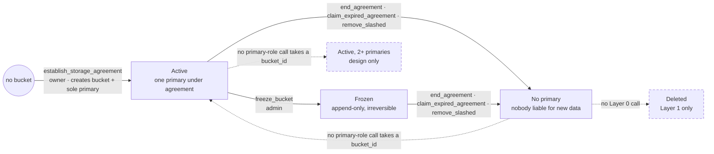

# RFC draft: Bucket lifecycle and transfer between providers

> Gap summary for the design owner, no proposal. Written against `dev` at
> 7a9673c0 (2026-09-14). "The design" is
> `docs/design/scalable-web3-storage.md`; "the implementation doc" is
> `docs/design/scalable-web3-storage-implementation.md`.

## Story

A dApp operator owns bucket `B`. The dApp's users write into `B`. The operator
never had a local copy of the data and cannot ask the users to upload it
again.

`B` has one primary provider `P1` under a 1-year agreement. Before it expires,
`B` must continue on provider `P2`:

- same `bucket_id`, because DNS TXT / DotNS records, `bucket://` URIs, Layer 1
  drives, replica agreements, members and contracts all reference it, and the
  design promises "the bucket_id never changes";
- `P2` is a primary, because replicas are read-only and the dApp keeps
  writing;
- `P2` gets the data from `P1` or a replica, nobody re-uploads;
- the operator sees on chain that `P2` has the data before `P1` leaves.

**Today this is not possible.** The only way to put a second provider under
contract is `establish_storage_agreement`, which creates a new bucket. The
design describes multi-primary buckets ("Add 2-3 diverse providers") but
specifies no way to add a primary to an existing bucket, and the pallet has
none. Data movement between primaries is assigned to the client ("client
re-uploads"). Replicas sync automatically but cannot take writes.

## Bucket lifecycle (code on `dev`)

A Layer 0 bucket has four states. Only the transitions listed exist.

| State | Meaning |
|---|---|
| **Active** | One primary under agreement. Writes, checkpoints and challenges work. Replicas optional. |
| **Frozen** | Active, but append-only from the frozen snapshot. Irreversible. |
| **No primary** | The primary agreement ended. Bucket, members, snapshot and replica agreements remain. No provider can sign a checkpoint, so no new data is committed with anyone liable for it. Only replicas still under agreement are challengeable. (`set_min_providers(0)` exposure: see *Drifts*.) |
| **Deleted** | Bucket and all agreements removed. No Layer 0 call; reachable only through Layer 1. |

| From | To | Call | Caller |
|---|---|---|---|
| — | Active | `establish_storage_agreement` (creates the bucket and its only primary) | owner, redeeming provider-signed terms |
| Active | Active | `establish_replica_agreement`, `extend_agreement`, `top_up_agreement`, `top_up_replica_sync_balance`, `set_member`, `remove_member`, `set_bucket_visibility`, `set_min_providers`, `checkpoint`, `extend_checkpoint` | owner / admin / writers |
| Active | Frozen | `freeze_bucket` | admin |
| Active, Frozen | No primary | `end_agreement` (early or after expiry) · `claim_expired_agreement` (after `SettlementTimeout`) · `remove_slashed` (provider stake is zero) | owner, also admin if early · provider · anyone |
| any | Deleted | Layer 1 `delete_drive` → `cleanup_bucket_internal`; refused while any agreement has a pending challenge | drive owner who is bucket admin |

`deregister_provider` is rejected while the provider has active agreements.
`delete_s3_bucket` removes the S3 registry entry only; the Layer 0 bucket and
its agreements remain.

Solid arrows exist on `dev`. Dashed arrows and states have no Layer 0 call.
In-state calls omitted.

### Not implemented

- **A primary can only be attached at bucket creation.**
  `establish_storage_agreement` is the sole primary-role entry and requires
  `terms.bucket_id == None`; only the replica call accepts an existing bucket.
  Consequences: (a) no second primary, so `min_providers`, the signature
  bitfield and `extend_checkpoint` are unreachable outside tests
  (`set_min_providers` is capped by the primary count and can only hold 0 or
  1); (b) *No primary* is terminal: a bucket whose primary expired, ended or
  was slashed stays read-only forever under the same `bucket_id` (PR #403
  removed the `ProviderAddedToBucket` event as dead code); (c) a replica
  cannot be promoted, and a provider cannot hold both roles on one bucket;
  (d) the path existed as `create_bucket` + request/accept and was removed by
  #97 / PR #105 (PR #376 DRIFT-002), see *2. Multi-provider*.
- **Owner change.** `transfer_agreement_ownership` is in the design only.
  Open PR #414 implements it; it moves the payer, not the data.
- **Agreement end is a single block edge.** Liability, challengeability,
  payment and the data obligation all end at the expiry block. There is no
  retention window in which a successor can fetch from a still-liable
  provider; renewal needs a live, funded owner before the edge, and the
  provider can block extensions one block before it.
- **Delete at Layer 0.** No extrinsic. A bucket not backed by a drive cannot be
  deleted.

## Main questions

Six topics, in meeting order.

### 1. Bucket lifecycle

- **Stable `bucket_id` across providers.** The design promises it and has no
  path to keep it. Whether the path is "add a primary, then end the old one"
  or "replace the primary" follows from topic 2.
- **Agreement end as a phase.** Should the end be a phase, notice → expiry →
  retention, rather than one block: a minimum notice period, auto-renew from
  escrow, and a retention period during which the provider stays
  challengeable so a transfer has a window? Who may extend the edge: owner,
  escrow, provider?

### 2. Multi-provider

Decide first whether multi-primary is still the target (see *Not
implemented*). If yes, the join path is the missing piece and the rest
follows. If no, the design should say single primary plus replicas, and
transfer reduces to replacing the one primary.

- **How the join path went missing.** It was never rejected; it fell out of
  PR #105 as a side effect. The design is bucket-first: create the bucket,
  then attach providers one agreement at a time (`create_bucket`, then
  `request_primary_agreement` + `accept_agreement`; `create_bucket_with_storage`
  as a one-call shortcut with on-chain matching). #97 moved negotiation
  off-chain because the on-chain matching was O(n) over all providers, the
  pending `AgreementRequests` map only bridged two extrinsics, and the shortcut
  bound a provider without its consent. Its ideal flow was
  `establish_agreement(bucket_id, provider, terms, sig)` on an existing bucket,
  while its scope list also removed `create_bucket`. PR #105 (merged
  2026-06-12) resolved that tension by folding bucket creation into the
  agreement: `terms.bucket_id` must be `None`, the bucket is created with
  `min_providers = 1` and the signer as its only primary, and Layer 1
  (`create_drive`, `create_s3_bucket`) goes through the same internal.
- **Where the join path fits.** Two shapes: (a) generalise
  `establish_storage_agreement` so `terms.bucket_id == Some(id)` attaches a
  primary to an existing bucket, the #97 shape, which also covers promoting a
  replica; (b) a separate `add_primary_provider(bucket_id, provider, terms,
  sig)` mirroring the replica call. Open in both: who redeems it (an admin,
  or anyone the provider quoted for, with admin consent) and who owns the
  agreement.
- **Provider-to-provider transfer.** Should a joining primary obtain the
  data from any provider under agreement on the bucket, the way replicas do,
  instead of the client re-uploading? (#65 §1, §4) On a private bucket the
  joiner has no honest data source unless the admin adds it as a member or a
  replica exists.
- **Liability of a joining primary.** A primary is slashable only for
  snapshots it signed, and only a writer/admin can add its signature. Should
  a primary attest possession itself? Is there a middle ground between
  "one signature is enough" and "all primaries must sign"?
- **Replica as warm standby.** Is a replica meant to be the succession
  candidate? If so, promote it in place, or let one provider be replica and
  primary of one bucket at once?

### 3. Incentives

- **Capital cost of a 1-year primary.** The stake is a hold that earns
  nothing, so it forgoes relay staking yield for the life of the longest
  agreement, and the fee arrives at settlement (topic 4). Acceptable, or
  should the fee stream or vest per checkpoint?
- **Nobody challenges.** A successful challenger gets a refund and no reward
  (design v2.1), and the provider node does not challenge. Who verifies a
  departing or joining primary?
- **Slash granularity.** One failed challenge slashes the entire global
  stake across all agreements, including while a provider winds down one
  bucket and serves others.
- **Overlap payment.** During a transfer both providers are paid for the
  same bytes and the bulk fetch is unpaid.

### 4. 1-year contract numbers

Fee = `price_per_byte × max_bytes × duration`, in integer plancks per byte
per anchor block; one year is 5,256,000 anchor blocks. The whole fee is
escrowed upfront as a hold on the owner and paid out at settlement; early end
refunds `fee × remaining / total`. `MinStakePerByte` on Paseo `dev` is 1,000
plancks, 1 UNIT per GB; other constants are in the implementation doc's
reference values.

- **Price granularity.** The smallest non-zero price is 1 planck per byte
  per block, so 1 GB for a year costs at least 5,256 UNIT against 1 UNIT of
  stake backing the same bytes, a 5,256× ratio; a 100 GB bucket escrows
  525,600 UNIT on day one. Is zero pricing the intended default, or does the
  unit need to change (per GB-block, per byte-day, fixed-point price)?

### 5. dApp integration

- **dApp user data ownership.** One operator bucket (users as writers, a
  shared key, or a contract), one bucket per user, or contract-owned
  buckets? Does every user need an agreement? The design has no dApp use
  case.
- **Layer 1 (outside Layer 0 scope, listed for the meeting).** `delete_drive`
  ends every agreement on the bucket early, third-party replicas included
  (see *Drifts*). Drive fields mirror the first agreement and never update.
  After PR #414 a drive owner and its agreement owner can diverge. What does
  Layer 1 want here?

### 6. Bulletin vs Web3 Storage coexistence

Bulletin is fee-less, unstaked, authorization-gated, ~14-day renewable TTL,
real IPFS CIDs over Bitswap, and officially interim until the JAM data lake.
Web3 Storage (w3s) is paid, staked, long-term, with no CIDs and no Bitswap;
it is the durable storage market, not a data availability service (#43).
Three models are on the tracker; the "must add" column is mostly retrieval
and provider-node work, not Layer 0:

| Model | Shape | Issue | w3s must add |
|---|---|---|---|
| Replace | DotNS, dotli, bulletin-deploy move to w3s buckets | #132 | website/SPA serving, gateway, naming |
| Durability tier | Bulletin publishes, a w3s replica keeps the bytes past the TTL | #391 | a replica that syncs from Bulletin; today replicas sync only from w3s primaries |
| Shared retrieval plane | both serve the same content addresses | #390 | real CIDs or a CID↔`data_root` map, chunking parity, Bitswap in the provider |

- **Which model first.** Replace follows the official direction; durability
  tier is the smallest change; shared retrieval touches the data model.
- **Replica from a foreign source.** The replica role is read-only and must
  confirm against the current snapshot root or one of six historical roots
  refreshed on windows of 3 to 113 anchor blocks (about 11 minutes at the
  widest), which a large busy bucket can outrun. Bulletin content has no such
  root. Own role, or a relaxed confirmation rule?
- **Who pays and who is liable.** A w3s replica is paid and slashable. Who
  owns the mirror agreement, and does the transfer path from topic 2 apply
  once the mirror is the only copy after the TTL?

## Drifts (docs vs. code)

Untracked, likely code bugs:

- `set_min_providers` has no lower bound (`InvalidMinProviders` only guards
  the upper one) and `checkpoint` only checks `signing_count >=
  min_providers`. An admin can set 0 and commit a snapshot with an empty
  signature list, so a bucket, including one in *No primary*, can carry a
  snapshot no provider is liable for. Bucket creation seeds `min_providers =
  1`; nothing lowers it when the primary leaves, so the exposure needs an
  explicit admin call. Adjacent to #388, no issue yet. Under a single-primary
  answer to topic 2 the call is dead code and can go.
- `extend_checkpoint` silently drops a signer bit beyond the stored bitfield.
  Multi-primary machinery; disposition follows topic 2.
- `delete_drive` early-terminates replicas with refunds; the design forbids
  both.

Design text vs. code:

- "Liable for signed snapshots until superseded" ends at expiry in code
  (topic 1).
- Stale pre-#105 API: the implementation doc still documents `create_bucket`,
  `create_bucket_with_storage` and the `AgreementRequested` / `Accepted` /
  `Rejected` / `RequestWithdrawn` events next to the `establish_*` section
  that replaced them; `docs/drafts/marketplace.md` and
  `docs/drafts/smart-contracts.md` still show `request_agreement()` and
  `createBucket`.

Already tracked: the provider node accepts uploads and commits for buckets
where it has no agreement or the wrong role (#382 covers quota); read and
sync endpoints are unauthenticated (#383).

## Related

Not cited above: #281, #107 (migration, wind-down) · #332, #302
(multi-provider checkpoints) · #134, #133 (dApps) · #310 (provider node) ·
`docs/drafts/CHECKPOINT_PROTOCOL.md`.
