# Extrinsic Execution Flows

This document provides detailed sequence diagrams for all major extrinsics in the Scalable Web3 Storage system, explaining the flow of data between clients, providers, and the blockchain.

Every on-chain block quantity in these diagrams (deadlines, expiries,
timeouts, `current_block`) is denominated on the **anchor clock** — the relay
chain in production, read via `current_anchor_block()`. Pseudocode showing
`frame_system::block_number()` or `current_block` is illustrative; the
implementation reads the anchor. See the anchor-clock section in
[scalable-web3-storage-implementation.md](../design/scalable-web3-storage-implementation.md).

## Table of Contents

1. [Overview](#overview)
2. [Why Checkpoints Require Provider Signatures](#why-checkpoints-require-provider-signatures)
3. [Provider Registration](#provider-registration)
4. [Bucket Creation](#bucket-creation)
5. [Storage Agreements](#storage-agreements)
6. [Data Upload Flow](#data-upload-flow)
7. [Checkpoint (Commitment) Flow](#checkpoint-commitment-flow)
8. [Data Read Flow](#data-read-flow)
9. [Challenge Flow](#challenge-flow)
10. [Layer 1: Drive Operations](#layer-1-drive-operations)

---

## Overview

The system has a clear separation between:

- **On-chain operations**: Executed as blockchain extrinsics (transactions)
- **Off-chain operations**: HTTP requests to provider nodes

```
┌──────────────────────────────────────────────────────────────────────────┐
│                        Trust Boundaries                                  │
├──────────────────────────────────────────────────────────────────────────┤
│                                                                          │
│  ┌──────────────┐         ┌──────────────┐         ┌──────────────┐      │
│  │    Client    │◄───────►│   Provider   │         │  Blockchain  │      │
│  │              │  HTTP   │    Node      │         │   (Pallet)   │      │
│  └──────────────┘         └──────────────┘         └──────────────┘      │
│         │                        │                        ▲              │
│         │                        │                        │              │
│         └────────────────────────┴────────────────────────┘              │
│                           Extrinsics (signed transactions)               │
│                                                                          │
│  Trust Level:                                                            │
│  • Blockchain: Trustless (consensus-verified)                            │
│  • Provider HTTP: Accountable (signature + stake + challenge)            │
│  • Client: Application-specific                                          │
│                                                                          │
└──────────────────────────────────────────────────────────────────────────┘
```

---

## Why Checkpoints Require Provider Signatures

### The Problem

When a client uploads data to a provider, how do we ensure the provider actually stores it? The provider could:

1. Accept the data, discard it, and claim storage payment
2. Store it initially but delete it later
3. Serve data only when convenient

### The Solution: Signed Commitments

Provider signatures on checkpoints create **non-repudiable evidence**:

```
┌──────────────────────────────────────────────────────────────────────────┐
│  CommitmentPayload (what providers sign)                                 │
├──────────────────────────────────────────────────────────────────────────┤
│  {                                                                       │
│    version: 3,                    // Protocol version                    │
│    bucket_id: u64,                // Which bucket                        │
│    commitment: Commitment {                                              │
│      mmr_root: H256,              // Merkle Mountain Range root          │
│      start_seq: u64,              // First leaf index                    │
│      leaf_count: u64,             // Number of leaves                    │
│    },                                                                    │
│  }                                                                       │
├──────────────────────────────────────────────────────────────────────────┤
│  By signing this, the provider attests:                                  │
│  "I have stored all data corresponding to this MMR root"                 │
│                                                                          │
│  The signature becomes EVIDENCE for:                                     │
│  1. On-chain challenges (challenge_checkpoint)                           │
│  2. Off-chain challenges (challenge_offchain)                            │
│  3. Slashing if provider cannot produce data                             │
└──────────────────────────────────────────────────────────────────────────┘
```

### Why Not Just Trust the Client?

The client could submit a checkpoint claiming the provider stored data, but:

- The provider might not have the data
- There's no evidence linking the provider to the commitment
- Challenges would be unfair (provider didn't agree to store)

**Provider signature = Provider's agreement to be held accountable**

### Multi-Provider Checkpoints

For buckets with multiple providers, we need consensus:

```
┌──────────────────────────────────────────────────────────────────────────┐
│  Checkpoint Threshold Requirement                                        │
├──────────────────────────────────────────────────────────────────────────┤
│                                                                          │
│  Example: Bucket with 3 primary providers                                │
│                                                                          │
│  Provider A signs: ✓                                                     │
│  Provider B signs: ✓                                                     │
│  Provider C signs: ✗ (unavailable)                                       │
│                                                                          │
│  Threshold: 51% must sign                                                │
│  Result: 2/3 = 66.7% ✓ Checkpoint accepted                               │
│                                                                          │
│  Bitfield stored on-chain: 0b00000011                                    │
│  (bit 0 = Provider A, bit 1 = Provider B)                                │
│                                                                          │
│  Only signed providers can be challenged for this checkpoint!            │
│                                                                          │
└──────────────────────────────────────────────────────────────────────────┘
```

---

## Provider Registration

### Extrinsic: `register_provider`

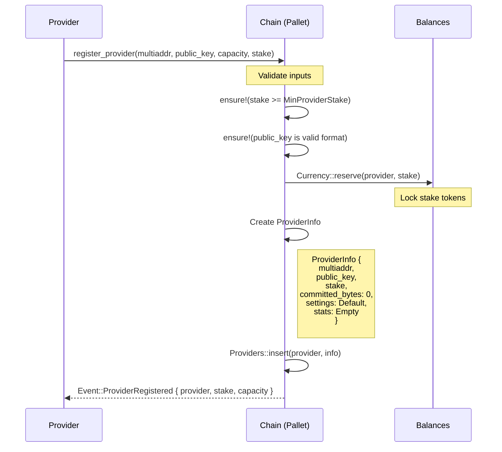
```mermaid
sequenceDiagram
    participant P as Provider
    participant C as Chain (Pallet)
    participant B as Balances

    P->>C: register_provider(multiaddr, public_key, capacity, stake)

    Note over C: Validate inputs
    C->>C: ensure!(stake >= MinProviderStake)
    C->>C: ensure!(public_key is valid format)

    C->>B: Currency::reserve(provider, stake)
    Note over B: Lock stake tokens

    C->>C: Create ProviderInfo
    Note right of C: ProviderInfo {<br/>multiaddr, <br/> public_key,<br/> stake,<br/> committed_bytes: 0, <br/> settings: Default, <br/>stats: Empty <br/>}<br/>

    C->>C: Providers::insert(provider, info)

    C-->>P: Event::ProviderRegistered { provider, stake, capacity }
```

### Extrinsic: `update_provider_settings`

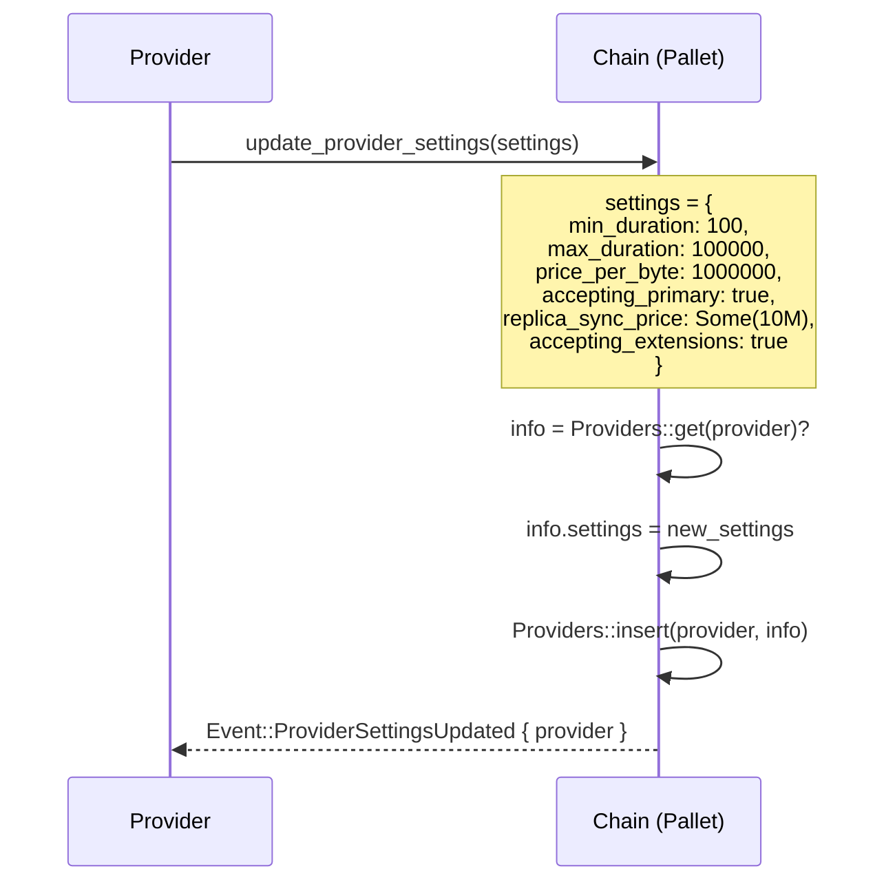
```mermaid
sequenceDiagram
    participant P as Provider
    participant C as Chain (Pallet)

    P->>C: update_provider_settings(settings)

    Note over C: settings = {<br/> min_duration: 100,<br/> max_duration: 100000,<br/> price_per_byte: 1000000,<br/> accepting_primary: true,<br/> replica_sync_price: Some(10M),<br/> accepting_extensions: true<br/>}

    C->>C: info = Providers::get(provider)?
    C->>C: info.settings = new_settings
    C->>C: Providers::insert(provider, info)

    C-->>P: Event::ProviderSettingsUpdated { provider }
```

---

## Bucket Creation

### Extrinsic: `create_bucket`

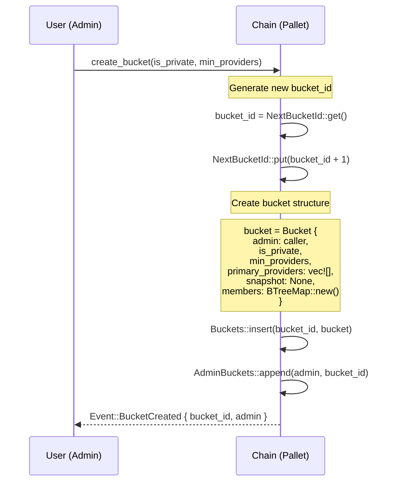
```mermaid
sequenceDiagram
    participant U as User (Admin)
    participant C as Chain (Pallet)

    U->>C: create_bucket(is_private, min_providers)

    Note over C: Generate new bucket_id
    C->>C: bucket_id = NextBucketId::get()
    C->>C: NextBucketId::put(bucket_id + 1)

    Note over C: Create bucket structure
    Note over C: bucket = Bucket {<br/> admin: caller,<br/> is_private,<br/> min_providers,<br/> primary_providers: vec![],<br/> snapshot: None,<br/> members: BTreeMap::new()<br/>}

    C->>C: Buckets::insert(bucket_id, bucket)
    C->>C: AdminBuckets::append(admin, bucket_id)

    C-->>U: Event::BucketCreated { bucket_id, admin }
```

---

## Storage Agreements

### Extrinsic: `request_agreement`

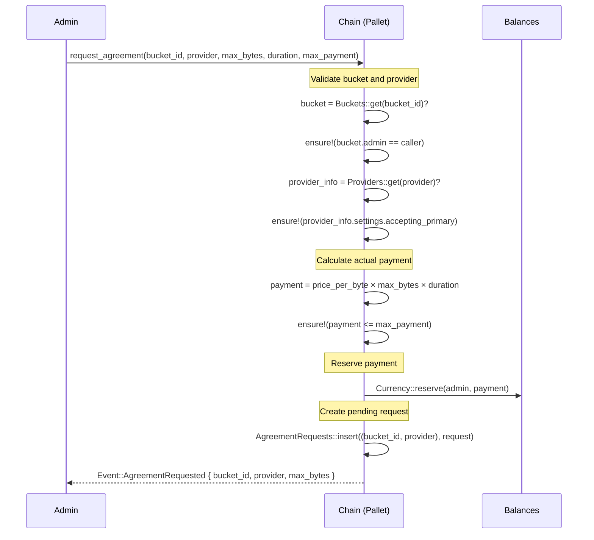
```mermaid
sequenceDiagram
    participant A as Admin
    participant C as Chain (Pallet)
    participant B as Balances

    A->>C: request_agreement(bucket_id, provider, max_bytes, duration, max_payment)

    Note over C: Validate bucket and provider
    C->>C: bucket = Buckets::get(bucket_id)?
    C->>C: ensure!(bucket.admin == caller)
    C->>C: provider_info = Providers::get(provider)?
    C->>C: ensure!(provider_info.settings.accepting_primary)

    Note over C: Calculate actual payment
    C->>C: payment = price_per_byte × max_bytes × duration
    C->>C: ensure!(payment <= max_payment)

    Note over C: Reserve payment
    C->>B: Currency::reserve(admin, payment)

    Note over C: Create pending request
    C->>C: AgreementRequests::insert((bucket_id, provider), request)

    C-->>A: Event::AgreementRequested { bucket_id, provider, max_bytes }
```

### Extrinsic: `accept_agreement`

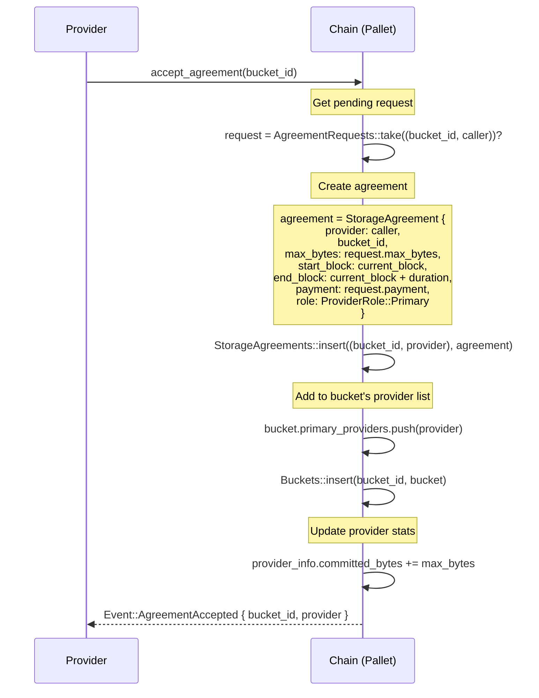
```mermaid
sequenceDiagram
    participant P as Provider
    participant C as Chain (Pallet)

    P->>C: accept_agreement(bucket_id)

    Note over C: Get pending request
    C->>C: request = AgreementRequests::take((bucket_id, caller))?

    Note over C: Create agreement
    Note over C: agreement = StorageAgreement {<br/> provider: caller,<br/> bucket_id,<br/> max_bytes: request.max_bytes,<br/> start_block: current_block,<br/> end_block: current_block + duration,<br/> payment: request.payment,<br/> role: ProviderRole::Primary<br/>}

    C->>C: StorageAgreements::insert((bucket_id, provider), agreement)

    Note over C: Add to bucket's provider list
    C->>C: bucket.primary_providers.push(provider)
    C->>C: Buckets::insert(bucket_id, bucket)

    Note over C: Update provider stats
    C->>C: provider_info.committed_bytes += max_bytes

    C-->>P: Event::AgreementAccepted { bucket_id, provider }
```

---

## Data Upload Flow

This is the primary off-chain flow where data is actually stored:

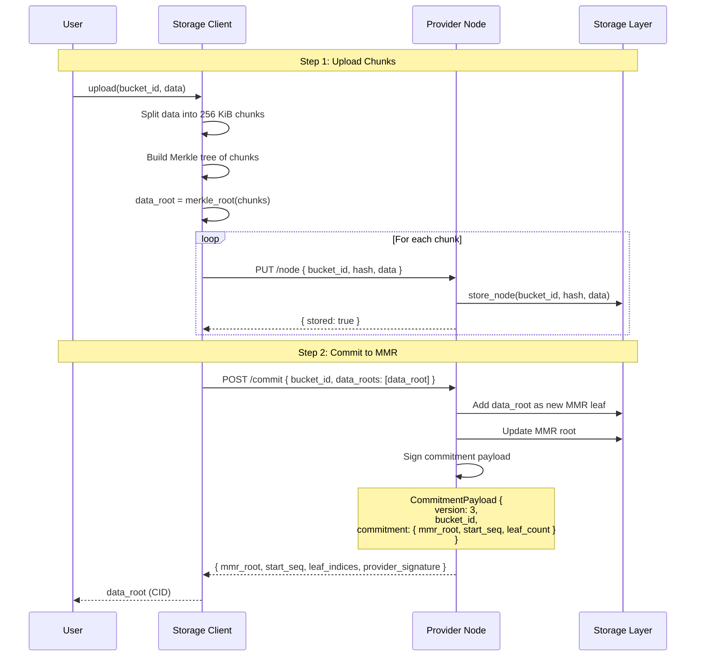
```mermaid
sequenceDiagram
    participant U as User
    participant SC as Storage Client
    participant PN as Provider Node
    participant S as Storage Layer

    Note over U,S: Step 1: Upload Chunks
    U->>SC: upload(bucket_id, data)

    SC->>SC: Split data into 256 KiB chunks
    SC->>SC: Build Merkle tree of chunks
    SC->>SC: data_root = merkle_root(chunks)

    loop For each chunk
        SC->>PN: PUT /node { bucket_id, hash, data }
        PN->>S: store_node(bucket_id, hash, data)
        PN-->>SC: { stored: true }
    end

    Note over U,S: Step 2: Commit to MMR
    SC->>PN: POST /commit { bucket_id, data_roots: [data_root] }

    PN->>S: Add data_root as new MMR leaf
    PN->>S: Update MMR root
    PN->>PN: Sign commitment payload

    Note over PN: CommitmentPayload {<br/> version: 3,<br/> bucket_id,<br/> commitment: { mmr_root, start_seq, leaf_count }<br/>}

    PN-->>SC: { mmr_root, start_seq, leaf_indices, provider_signature }

    SC-->>U: data_root (CID)
```

---

## Checkpoint (Commitment) Flow

### Extrinsic: `submit_commitment`

This is how off-chain state becomes on-chain:

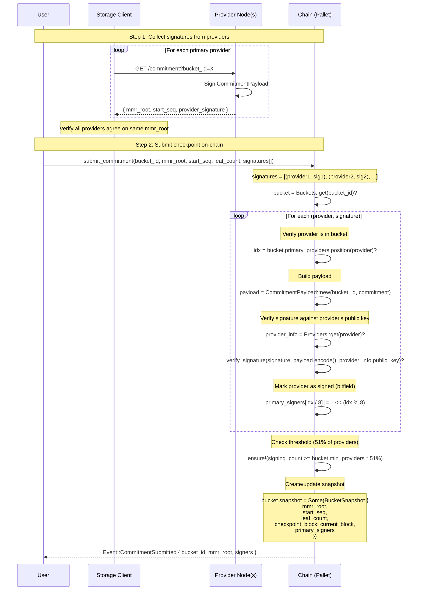
```mermaid
sequenceDiagram
    participant U as User
    participant SC as Storage Client
    participant PN as Provider Node(s)
    participant C as Chain (Pallet)

    Note over U,C: Step 1: Collect signatures from providers

    loop For each primary provider
        SC->>PN: GET /commitment?bucket_id=X
        PN->>PN: Sign CommitmentPayload
        PN-->>SC: { mmr_root, start_seq, provider_signature }
    end

    Note over SC: Verify all providers agree on same mmr_root

    Note over U,C: Step 2: Submit checkpoint on-chain

    U->>C: submit_commitment(bucket_id, mmr_root, start_seq, leaf_count, signatures[])

    Note over C: signatures = [(provider1, sig1), (provider2, sig2), ...]

    C->>C: bucket = Buckets::get(bucket_id)?

    loop For each (provider, signature)
        Note over C: Verify provider is in bucket
        C->>C: idx = bucket.primary_providers.position(provider)?

        Note over C: Build payload
        C->>C: payload = CommitmentPayload::new(bucket_id, commitment)

        Note over C: Verify signature against provider's public key
        C->>C: provider_info = Providers::get(provider)?
        C->>C: verify_signature(signature, payload.encode(), provider_info.public_key)?

        Note over C: Mark provider as signed (bitfield)
        C->>C: primary_signers[idx / 8] |= 1 << (idx % 8)
    end

    Note over C: Check threshold (51% of providers)
    C->>C: ensure!(signing_count >= bucket.min_providers * 51%)

    Note over C: Create/update snapshot
    Note over C: bucket.snapshot = Some(BucketSnapshot {<br/> mmr_root,<br/> start_seq,<br/> leaf_count,<br/> checkpoint_block: current_block,<br/> primary_signers<br/>})

    C-->>U: Event::CommitmentSubmitted { bucket_id, mmr_root, signers }
```

### Why Signature Verification Matters

```
┌──────────────────────────────────────────────────────────────────────────┐
│  Signature Verification Flow                                             │
├──────────────────────────────────────────────────────────────────────────┤
│                                                                          │
│  1. Provider registers with public_key                                   │
│     Providers::insert(provider_id, { public_key, ... })                  │
│                                                                          │
│  2. Provider signs commitment off-chain                                  │
│     signature = sr25519_sign(private_key, CommitmentPayload.encode())    │
│                                                                          │
│  3. On-chain verification                                                │
│     sr25519_verify(signature, payload, stored_public_key)                │
│                                                                          │
│  This ensures:                                                           │
│  • Only the registered provider could have signed                        │
│  • Provider agreed to store this specific data (mmr_root)                │
│  • Provider can be held accountable (challenged/slashed)                 │
│                                                                          │
└──────────────────────────────────────────────────────────────────────────┘
```

---

## Data Read Flow

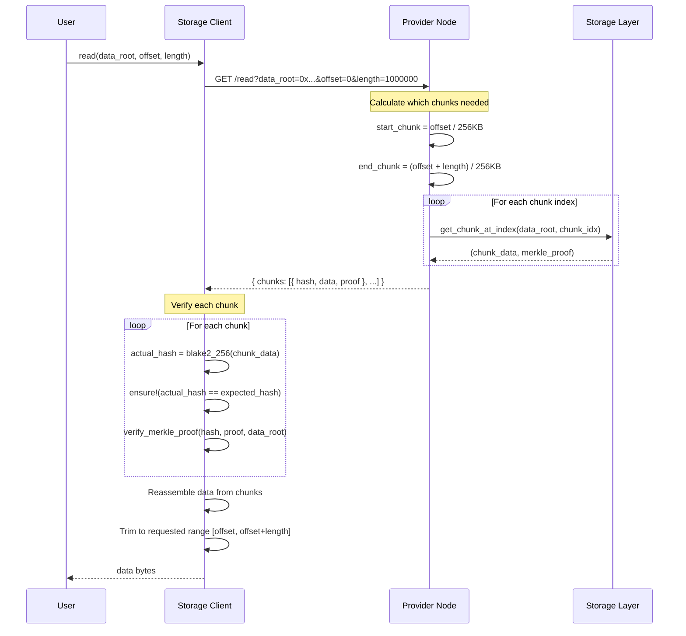
```mermaid
sequenceDiagram
    participant U as User
    participant SC as Storage Client
    participant PN as Provider Node
    participant S as Storage Layer

    U->>SC: read(data_root, offset, length)

    SC->>PN: GET /read?data_root=0x...&offset=0&length=1000000

    Note over PN: Calculate which chunks needed
    PN->>PN: start_chunk = offset / 256KB
    PN->>PN: end_chunk = (offset + length) / 256KB

    loop For each chunk index
        PN->>S: get_chunk_at_index(data_root, chunk_idx)
        S-->>PN: (chunk_data, merkle_proof)
    end

    PN-->>SC: { chunks: [{ hash, data, proof }, ...] }

    Note over SC: Verify each chunk
    loop For each chunk
        SC->>SC: actual_hash = blake2_256(chunk_data)
        SC->>SC: ensure!(actual_hash == expected_hash)
        SC->>SC: verify_merkle_proof(hash, proof, data_root)
    end

    SC->>SC: Reassemble data from chunks
    SC->>SC: Trim to requested range [offset, offset+length]

    SC-->>U: data bytes
```

---

## Challenge Flow

### Extrinsic: `challenge_checkpoint`

When a user suspects data loss:

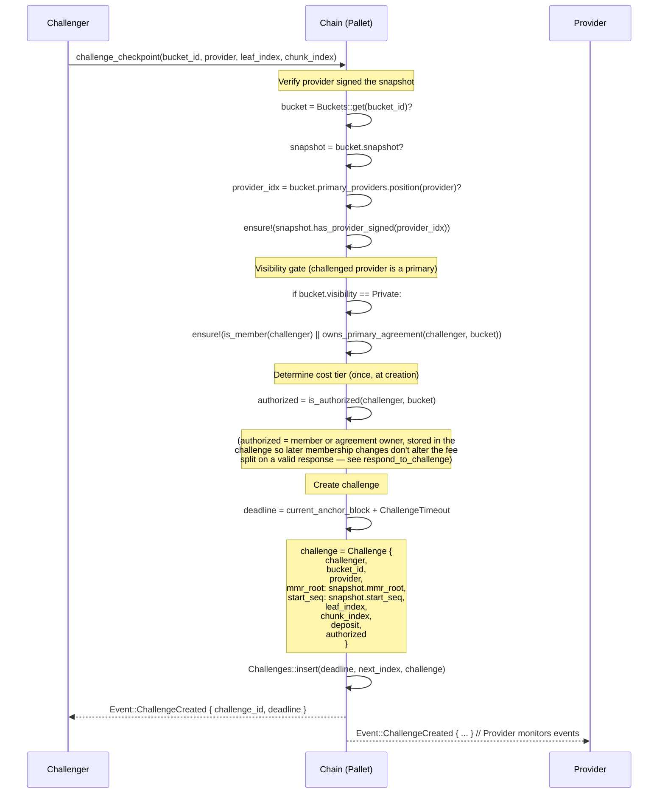
```mermaid
sequenceDiagram
    participant U as Challenger
    participant C as Chain (Pallet)
    participant P as Provider

    U->>C: challenge_checkpoint(bucket_id, provider, leaf_index, chunk_index)

    Note over C: Verify provider signed the snapshot
    C->>C: bucket = Buckets::get(bucket_id)?
    C->>C: snapshot = bucket.snapshot?
    C->>C: provider_idx = bucket.primary_providers.position(provider)?
    C->>C: ensure!(snapshot.has_provider_signed(provider_idx))

    Note over C: Visibility gate (challenged provider is a primary)
    C->>C: if bucket.visibility == Private:
    C->>C:   ensure!(is_member(challenger) || owns_primary_agreement(challenger, bucket))

    Note over C: Determine cost tier (once, at creation)
    C->>C: authorized = is_authorized(challenger, bucket)
    Note over C: (authorized = member or agreement owner, stored in the<br/>challenge so later membership changes don't alter the fee<br/>split on a valid response — see respond_to_challenge)

    Note over C: Create challenge
    C->>C: deadline = current_anchor_block + ChallengeTimeout
    Note over C: challenge = Challenge {<br/> challenger,<br/> bucket_id,<br/> provider,<br/> mmr_root: snapshot.mmr_root,<br/> start_seq: snapshot.start_seq,<br/> leaf_index,<br/> chunk_index,<br/> deposit,<br/> authorized<br/>}

    C->>C: Challenges::insert(deadline, next_index, challenge)

    C-->>U: Event::ChallengeCreated { challenge_id, deadline }
    C-->>P: Event::ChallengeCreated { ... }  // Provider monitors events
```

### Extrinsic: `respond_to_challenge`

Provider must prove they have the data:

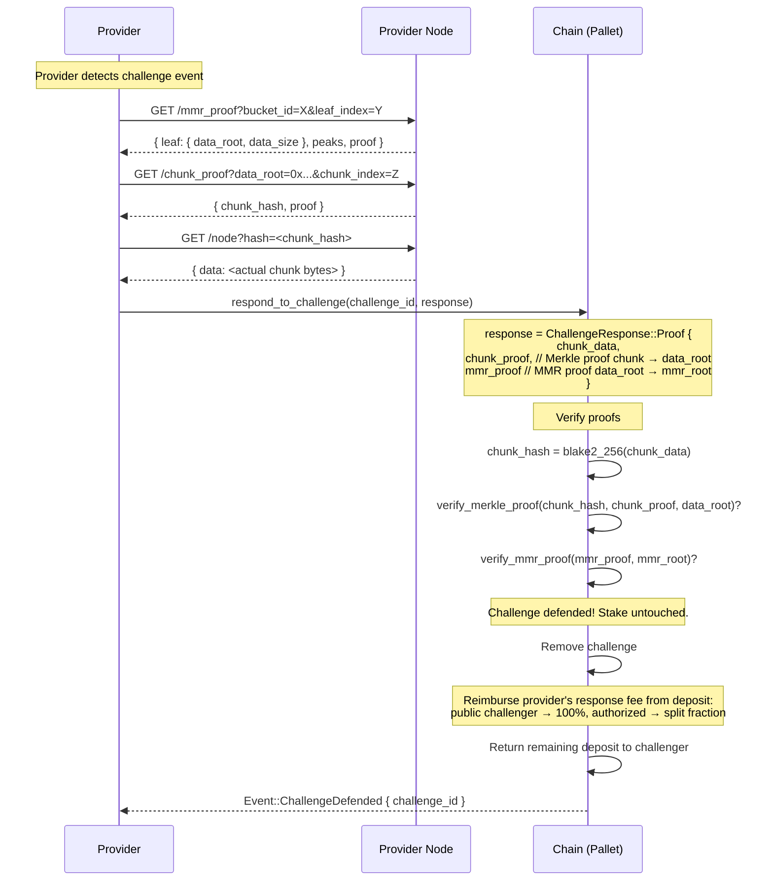
```mermaid
sequenceDiagram
    participant P as Provider
    participant PN as Provider Node
    participant C as Chain (Pallet)

    Note over P: Provider detects challenge event

    P->>PN: GET /mmr_proof?bucket_id=X&leaf_index=Y
    PN-->>P: { leaf: { data_root, data_size }, peaks, proof }

    P->>PN: GET /chunk_proof?data_root=0x...&chunk_index=Z
    PN-->>P: { chunk_hash, proof }

    P->>PN: GET /node?hash=<chunk_hash>
    PN-->>P: { data: <actual chunk bytes> }

    P->>C: respond_to_challenge(challenge_id, response)

    Note over C: response = ChallengeResponse::Proof {<br/> chunk_data,<br/> chunk_proof, // Merkle proof chunk → data_root<br/> mmr_proof // MMR proof data_root → mmr_root<br/>}

    Note over C: Verify proofs
    C->>C: chunk_hash = blake2_256(chunk_data)
    C->>C: verify_merkle_proof(chunk_hash, chunk_proof, data_root)?
    C->>C: verify_mmr_proof(mmr_proof, mmr_root)?

    Note over C: Challenge defended! Stake untouched.
    C->>C: Remove challenge
    Note over C: Reimburse provider's response fee from deposit:<br/>public challenger → 100%, authorized → split fraction
    C->>C: Return remaining deposit to challenger

    C-->>P: Event::ChallengeDefended { challenge_id }
```

### Automatic Slashing (if no response)

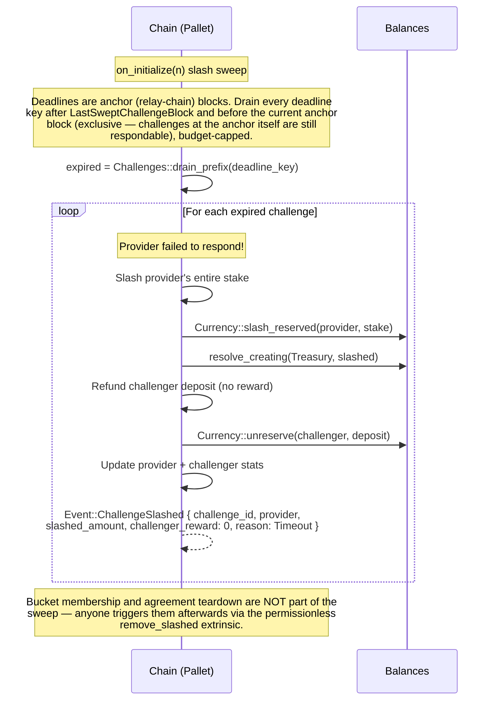
```mermaid
sequenceDiagram
    participant C as Chain (Pallet)
    participant B as Balances

    Note over C: on_initialize(n) slash sweep

    Note over C: Deadlines are anchor (relay-chain) blocks. Drain every deadline<br/>key after LastSweptChallengeBlock and before the current anchor<br/>block (exclusive — challenges at the anchor itself are still<br/>respondable), budget-capped.

    C->>C: expired = Challenges::drain_prefix(deadline_key)

    loop For each expired challenge
        Note over C: Provider failed to respond!

        C->>C: Slash provider's entire stake
        C->>B: Currency::slash_reserved(provider, stake)
        C->>B: resolve_creating(Treasury, slashed)

        C->>C: Refund challenger deposit (no reward)
        C->>B: Currency::unreserve(challenger, deposit)

        C->>C: Update provider + challenger stats

        C-->>C: Event::ChallengeSlashed { challenge_id, provider,<br/>slashed_amount, challenger_reward: 0, reason: Timeout }
    end

    Note over C: Bucket membership and agreement teardown are NOT part of the<br/>sweep — anyone triggers them afterwards via the permissionless<br/>remove_slashed extrinsic.
```

---

## Layer 1: Drive Operations

### Extrinsic: `create_drive` (Drive Registry Pallet)

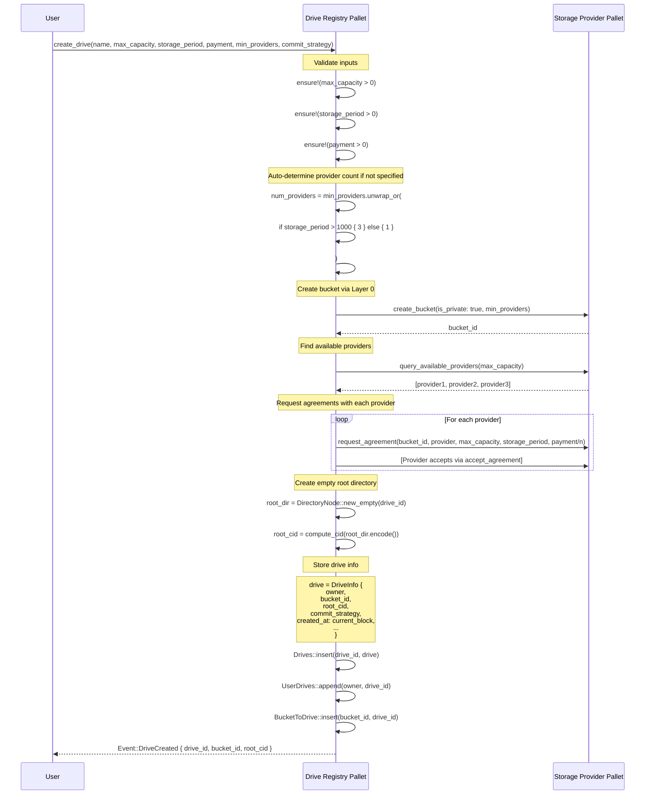
```mermaid
sequenceDiagram
    participant U as User
    participant DR as Drive Registry Pallet
    participant SP as Storage Provider Pallet

    U->>DR: create_drive(name, max_capacity, storage_period, payment, min_providers, commit_strategy)

    Note over DR: Validate inputs
    DR->>DR: ensure!(max_capacity > 0)
    DR->>DR: ensure!(storage_period > 0)
    DR->>DR: ensure!(payment > 0)

    Note over DR: Auto-determine provider count if not specified
    DR->>DR: num_providers = min_providers.unwrap_or(
    DR->>DR:   if storage_period > 1000 { 3 } else { 1 }
    DR->>DR: )

    Note over DR: Create bucket via Layer 0
    DR->>SP: create_bucket(is_private: true, min_providers)
    SP-->>DR: bucket_id

    Note over DR: Find available providers
    DR->>SP: query_available_providers(max_capacity)
    SP-->>DR: [provider1, provider2, provider3]

    Note over DR: Request agreements with each provider
    loop For each provider
        DR->>SP: request_agreement(bucket_id, provider, max_capacity, storage_period, payment/n)
        DR->>SP: [Provider accepts via accept_agreement]
    end

    Note over DR: Create empty root directory
    DR->>DR: root_dir = DirectoryNode::new_empty(drive_id)
    DR->>DR: root_cid = compute_cid(root_dir.encode())

    Note over DR: Store drive info
    Note over DR: drive = DriveInfo {<br/> owner,<br/> bucket_id,<br/> root_cid,<br/> commit_strategy,<br/> created_at: current_block,<br/> ...<br/>}

    DR->>DR: Drives::insert(drive_id, drive)
    DR->>DR: UserDrives::append(owner, drive_id)
    DR->>DR: BucketToDrive::insert(bucket_id, drive_id)

    DR-->>U: Event::DriveCreated { drive_id, bucket_id, root_cid }
```

### Extrinsic: `update_root_cid`

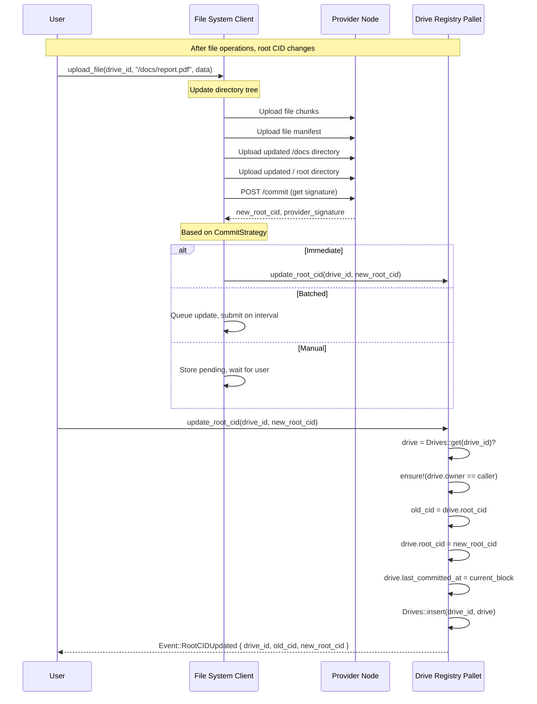
```mermaid
sequenceDiagram
    participant U as User
    participant FSC as File System Client
    participant PN as Provider Node
    participant DR as Drive Registry Pallet

    Note over U,DR: After file operations, root CID changes

    U->>FSC: upload_file(drive_id, "/docs/report.pdf", data)

    Note over FSC: Update directory tree
    FSC->>PN: Upload file chunks
    FSC->>PN: Upload file manifest
    FSC->>PN: Upload updated /docs directory
    FSC->>PN: Upload updated / root directory
    FSC->>PN: POST /commit (get signature)
    PN-->>FSC: new_root_cid, provider_signature

    Note over FSC: Based on CommitStrategy
    alt Immediate
        FSC->>DR: update_root_cid(drive_id, new_root_cid)
    else Batched
        FSC->>FSC: Queue update, submit on interval
    else Manual
        FSC->>FSC: Store pending, wait for user
    end

    U->>DR: update_root_cid(drive_id, new_root_cid)

    DR->>DR: drive = Drives::get(drive_id)?
    DR->>DR: ensure!(drive.owner == caller)
    DR->>DR: old_cid = drive.root_cid
    DR->>DR: drive.root_cid = new_root_cid
    DR->>DR: drive.last_committed_at = current_block
    DR->>DR: Drives::insert(drive_id, drive)

    DR-->>U: Event::RootCIDUpdated { drive_id, old_cid, new_root_cid }
```

---

## Summary: Signature Role in the System

```
┌──────────────────────────────────────────────────────────────────────────┐
│  Why Signatures at Each Step                                             │
├──────────────────────────────────────────────────────────────────────────┤
│                                                                          │
│  1. Provider Registration                                                │
│     └─ Provider registers public_key on-chain                            │
│     └─ Establishes identity for signature verification                   │
│                                                                          │
│  2. Off-chain Commit                                                     │
│     └─ Provider signs CommitmentPayload                                  │
│     └─ Client stores signature as proof of provider's agreement          │
│                                                                          │
│  3. On-chain Checkpoint                                                  │
│     └─ Client submits provider signatures                                │
│     └─ Chain verifies each signature against provider's public_key       │
│     └─ Creates non-repudiable record of what provider claimed to store   │
│                                                                          │
│  4. Challenge                                                            │
│     └─ Anyone can challenge providers who signed the checkpoint          │
│     └─ Signature proves provider agreed to be accountable                │
│     └─ Provider must prove data or lose stake                            │
│                                                                          │
│  5. Off-chain Challenge (challenge_offchain)                             │
│     └─ For data not yet checkpointed on-chain                            │
│     └─ Client provides provider's signature from /commit response        │
│     └─ Chain verifies signature, creates challenge                       │
│                                                                          │
│  Result: Signatures create a chain of accountability                     │
│  Provider → "I have this data" (signature)                               │
│  Chain → "Prove it or lose stake" (challenge)                            │
│  Provider → "Here's the proof" OR → Slashed                              │
│                                                                          │
└──────────────────────────────────────────────────────────────────────────┘
```

---

## API Reference Links

- **[Layer 0 Extrinsics Reference](../reference/EXTRINSICS_REFERENCE.md)** - Complete pallet API
- **[Layer 1 API Reference](../filesystems/API_REFERENCE.md)** - File System API
- **[Architecture Overview](../filesystems/ARCHITECTURE.md)** - System architecture
- **[Admin Guide](../filesystems/ADMIN_GUIDE.md)** - System administration

---

*Last updated: February 2026*
