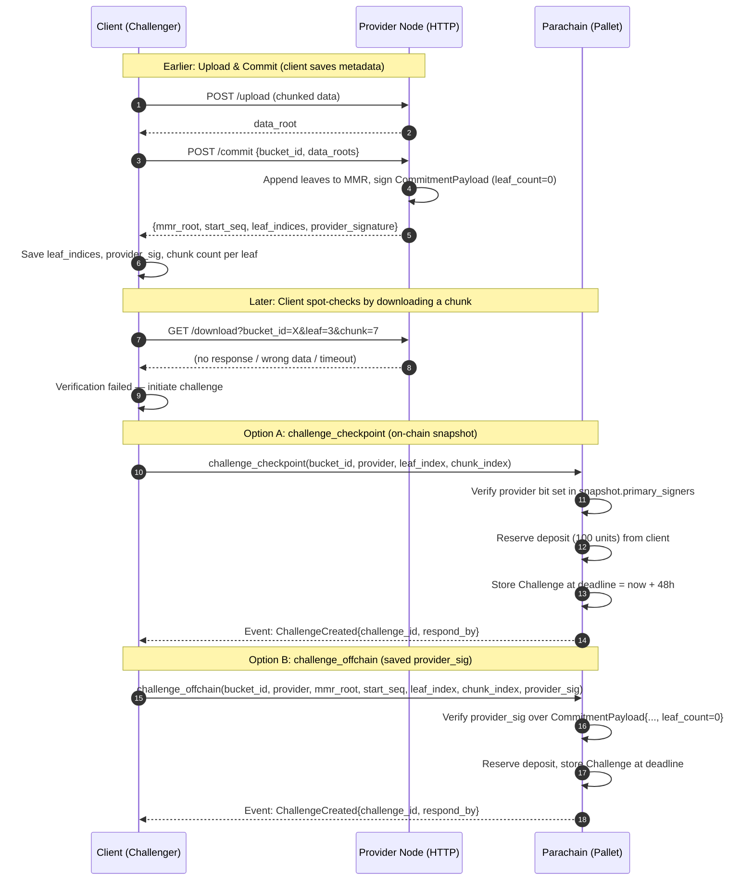

# Challenge Creation

The client (challenger) initiates a challenge when a provider fails to serve data. Two entry points converge into the same on-chain challenge.

## How the Client Knows `chunk_index` and `provider_sig`

| Parameter | Source |
|---|---|
| `chunk_index` | The client chunked the data itself (256 KiB chunks). Any index from `0` to `ceil(data_size / 256KiB) - 1` is valid. |
| `leaf_index` | Returned by `POST /commit` in the `leaf_indices` array. |
| `provider_sig` | Returned by `POST /commit` or `GET /commitment` (signed with `leaf_count=0`). |
| `mmr_root` | Returned by `POST /commit` or `GET /commitment`. |
| `start_seq` | Returned by `POST /commit` or `GET /commitment`. |

## Two Challenge Modes

- **`challenge_checkpoint`**: Uses the on-chain snapshot. No off-chain signature needed. Simpler but requires a checkpoint to exist.
- **`challenge_offchain`**: Uses the provider's off-chain commitment signature (with `leaf_count=0`). Works even without an on-chain checkpoint. Preferred for "hot" buckets where checkpoints change frequently.
