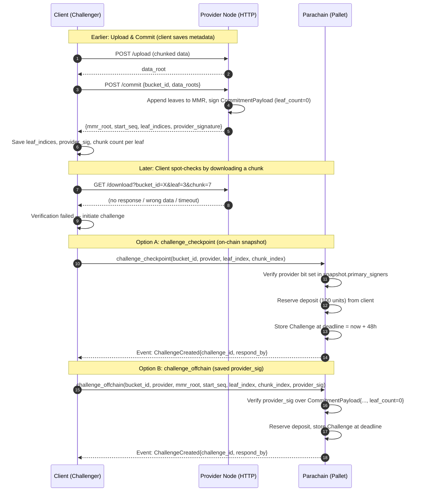

# Challenge Creation

The client (challenger) initiates a challenge when a provider fails to serve data. Two entry points converge into the same on-chain challenge.

## How the Client Knows `chunk_index` and `provider_sig`

| Parameter | Source |
|---|---|
| `chunk_index` | The client chunked the data itself (256 KiB chunks). Any index from `0` to `ceil(data_size / 256KiB) - 1` is valid. |
| `leaf_index` | Returned by `POST /commit` in the `leaf_indices` array. |
| `provider_sig` | Returned by `POST /commit` or `GET /commitment` (signed with `leaf_count=0`). |
| `mmr_root` | Returned by `POST /commit` or `GET /commitment`. |
| `start_seq` | Returned by `POST /commit` or `GET /commitment`. |

## Two Challenge Modes

### `challenge_checkpoint` (Recommended)

Uses the on-chain `BucketSnapshot` created by a prior checkpoint. The client only needs `leaf_index` and `chunk_index` — all commitment data (MMR root, provider signatures) is already on-chain.

**Advantages:**
- No local state required beyond knowing which leaf/chunk to challenge.
- Any client (or third party) can challenge — the on-chain snapshot is public.
- Works identically regardless of which device or user agent uploaded the data.
- Immune to client-side data loss — the chain is the source of truth.

**Requirement:** A checkpoint must exist for the bucket. This is why enabling and funding provider-initiated checkpoints (see [Provider-Initiated Checkpoint](./checkpoint-provider-initiated.md)) is important — it ensures the chain always has a recent snapshot to challenge against.

### `challenge_offchain` (Limited Applicability)

Uses a provider's off-chain commitment signature obtained during the write flow. The client must supply the `mmr_root`, `start_seq`, `leaf_index`, `chunk_index`, and `provider_signature` — all of which were returned in the `POST /commit` response at upload time.

**This mode has significant practical limitations:**

1. **Client must retain the commit response.** The `provider_signature`, `mmr_root`, `start_seq`, and `leaf_indices` are returned in a single HTTP response during upload. If the client does not persist this data, it is lost — the provider has no obligation to re-issue the same signature, and the MMR root changes with every subsequent write.

2. **Client-side data loss defeats the purpose.** If the device that performed the upload is lost, wiped, or the application data is cleared, the client no longer has the signature needed to create a challenge. This is precisely the scenario where a challenge might be most needed (the client cannot verify their data because they have lost their local record of it).

3. **Multi-device / multi-user-agent fragmentation.** When multiple devices (mobile, tablet, browser) write to the same bucket, each write produces a different `POST /commit` response with a different MMR root and provider signature. Device A has no knowledge of the signatures that device B received. This means:
   - Each device can only challenge based on its own writes.
   - No single device has a complete picture of the bucket's commitment history.
   - There is no built-in mechanism to synchronize these ephemeral signatures across devices.

4. **Signatures are point-in-time snapshots.** The provider signature covers the MMR root at the moment of that specific commit. As the bucket grows (more writes from any client or device), the MMR root changes. The old signature remains valid for challenging the specific leaves it covers, but the client must track which signature corresponds to which leaf indices.

**When it might still be useful:** For single-client, single-device scenarios where the application persists commit responses and needs to challenge data that has not yet been checkpointed on-chain. Even then, `challenge_checkpoint` is preferred once a checkpoint exists.

**Bottom line:** `challenge_checkpoint` is the robust, production-ready path. `challenge_offchain` is a lower-level primitive that requires careful client-side state management and does not scale well to multi-device use cases. Clients should ensure checkpoints are regularly created (via provider-initiated or client-initiated flows) so that `challenge_checkpoint` is always available.
