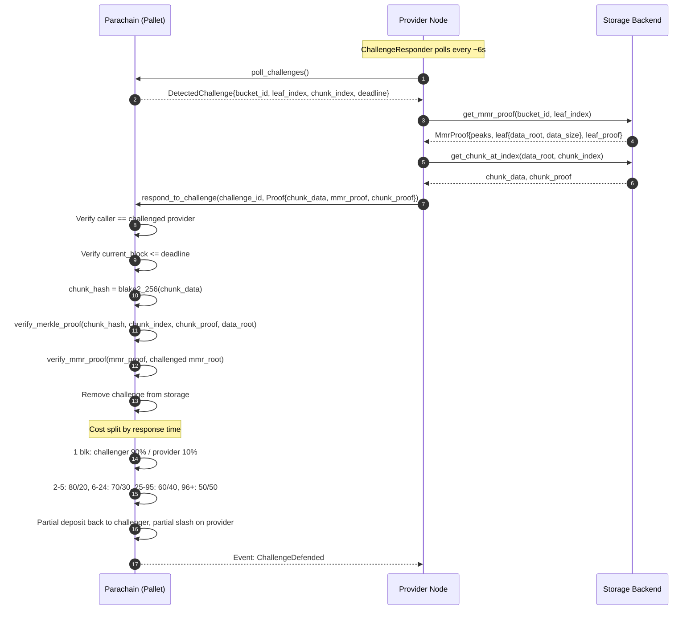

# Challenge Response (Successful Defense)

The provider detects a pending challenge, builds a two-layer proof from its storage backend, and submits it on-chain.

## Two-Layer Proof Verification

1. **Chunk in leaf**: `verify_merkle_proof(blake2_256(chunk_data), chunk_index, chunk_proof, data_root)` proves the chunk belongs to the data blob.
2. **Leaf in MMR**: `verify_mmr_proof(mmr_proof, mmr_root)` proves the leaf (containing `data_root`) is in the MMR the provider committed to.

## Time-Based Cost Split

The faster the provider responds, the more the challenger pays (discouraging frivolous challenges):

| Response Time (blocks) | Challenger Pays | Provider Pays |
|---|---|---|
| 1 | 90% | 10% |
| 2-5 | 80% | 20% |
| 6-24 | 70% | 30% |
| 25-95 | 60% | 40% |
| 96+ | 50% | 50% |

## Alternative Defenses

Besides `Proof`, providers can also respond with:
- **`Deleted`**: Admin signed a newer `CommitmentPayload` with `start_seq` beyond the challenged leaf (data was legitimately deleted).
- **`Superseded`**: A newer on-chain snapshot already covers the challenged leaf index (challenge is moot).
