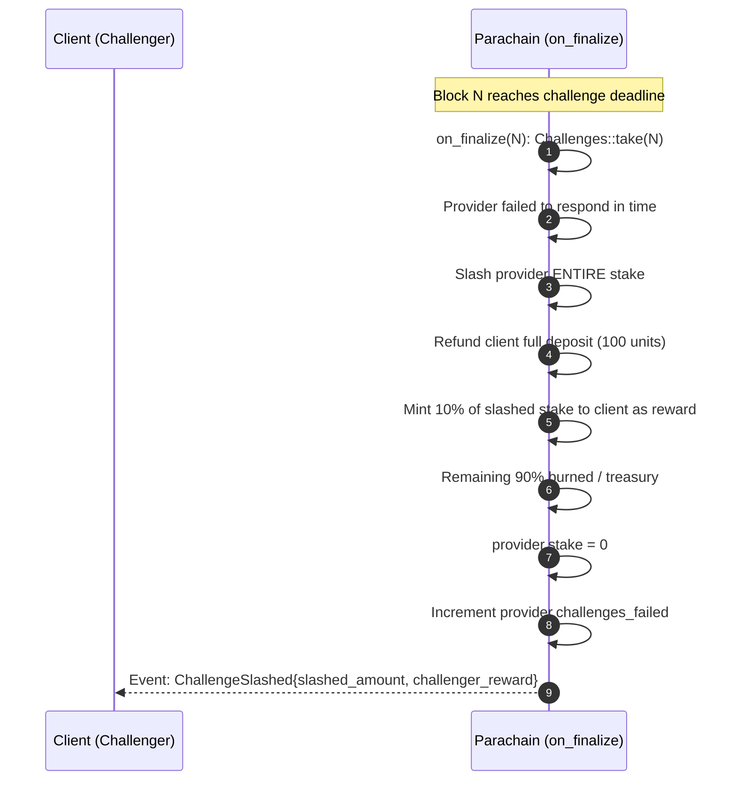

# Challenge Timeout & Slashing

When a provider fails to respond before the deadline, slashing happens automatically in `on_finalize` — no extrinsic needed.

## Key Details

- **Automatic**: Slashing is triggered by `on_finalize` at the deadline block. No one needs to call an extrinsic.
- **Full stake loss**: The provider's **entire stake** is slashed (not just a portion).
- **Challenger incentive**: Full deposit refund + 10% of the slashed stake as reward.
- **Remaining 90%**: Burned or sent to treasury via the runtime's slash handler.
- **Provider state**: `provider.stake` is set to 0 and `challenges_failed` is incremented.
- **Deadline**: `ChallengeTimeout` is configured at 48 hours (in blocks) in the runtime.
