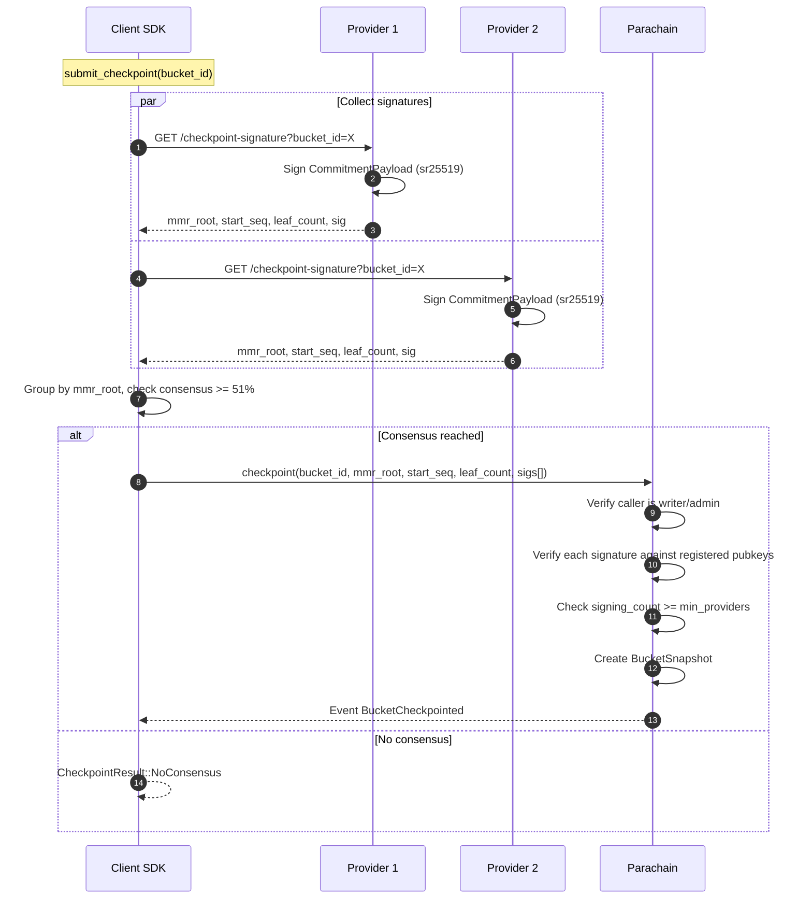

# Client-Initiated Checkpoint

The client orchestrates: collects provider signatures via HTTP, verifies consensus, then submits a single on-chain extrinsic.

## Key Details

- **CommitmentPayload** is signed with the **real** `leaf_count` (via `/checkpoint-signature`).
- The client verifies majority consensus (same `mmr_root` from >= 51% of providers) before submitting.
- On-chain, each signature is verified against the provider's registered public key, and the provider's bit is set in the `primary_signers` bitfield.
- The resulting `BucketSnapshot` makes providers liable for the data.
