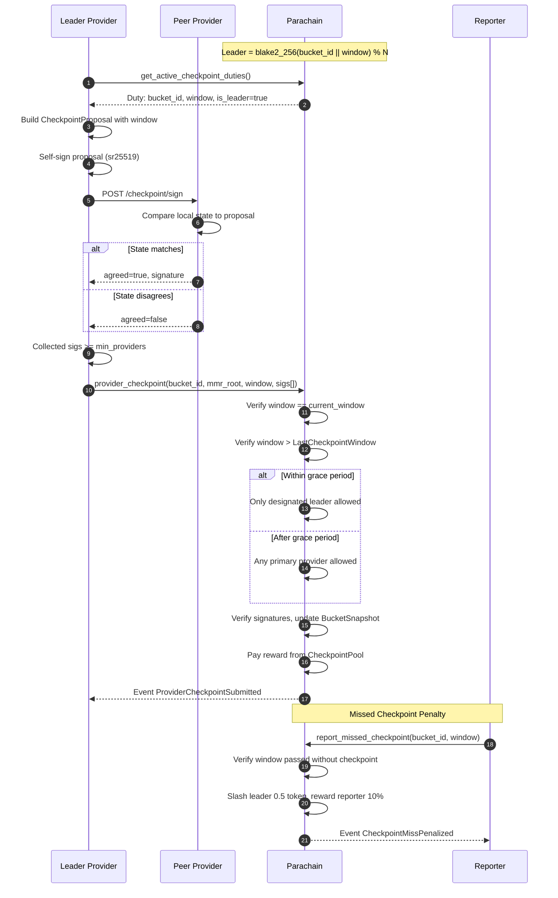

# Provider-Initiated Checkpoint

Autonomous: a deterministic leader coordinates signature collection from peers and submits on-chain. Includes grace period fallback and missed-window slashing.

## Key Details

- **Window**: `current_block / interval`. Default interval is 100 blocks.
- **Leader election**: Deterministic via `blake2_256(bucket_id || window) % num_providers`.
- **Grace period** (default 20 blocks): Only the leader can submit during grace. After grace, any primary provider can submit as fallback.
- **CheckpointProposal** includes the `window` field (unlike `CommitmentPayload`) to prevent cross-window replay.
- **Rewards**: Submitter receives `CheckpointReward` (1 token) from the `CheckpointPool` funded by clients.
- **Penalties**: If no checkpoint is submitted for a past window, anyone can call `report_missed_checkpoint`. The leader is slashed `CheckpointMissPenalty` (0.5 token), reporter gets 10%.
