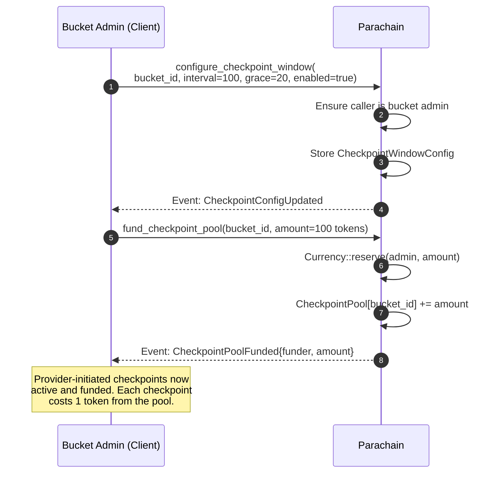
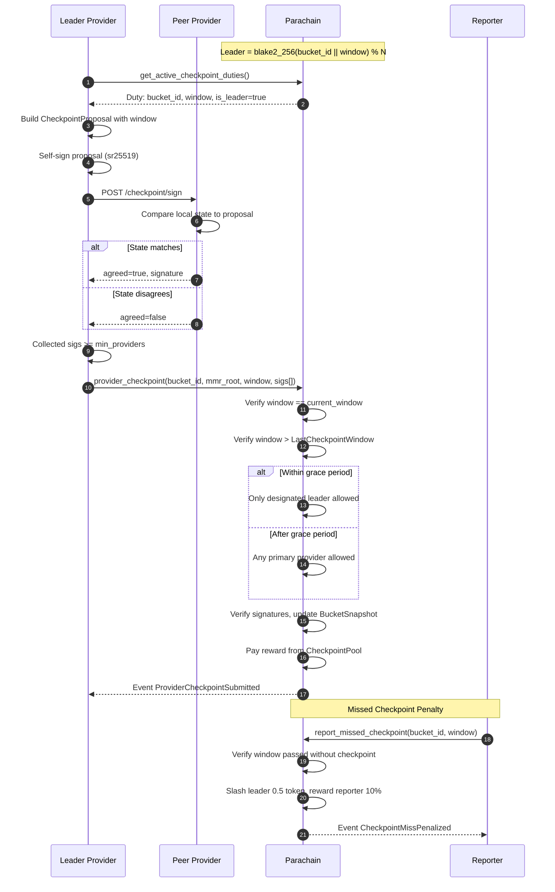

# Provider-Initiated Checkpoint

Autonomous: a deterministic leader coordinates signature collection from peers and submits on-chain. Includes grace period fallback and missed-window slashing.

## Prerequisite: Client Must Enable and Fund

Provider-initiated checkpoints are **enabled by default** on every bucket (with runtime defaults: interval=100 blocks, grace=20 blocks). However, the system only works sustainably when the **client (bucket admin)** actively configures and funds it:

1. **Configure** — The bucket admin calls `configure_checkpoint_window(bucket_id, interval, grace_period, enabled)` to set the checkpoint schedule. Setting `enabled=false` disables provider-initiated checkpoints entirely (client-initiated checkpoints via the `checkpoint` extrinsic still work regardless).

2. **Fund the reward pool** — The bucket admin (or anyone) calls `fund_checkpoint_pool(bucket_id, amount)` to deposit tokens into the bucket's reward pool. Each successful provider checkpoint deducts `CheckpointReward` (1 token) from this pool. **If the pool is empty, checkpoints still proceed but providers receive zero reward** — reducing their economic incentive to submit on time.

**This is a cost borne by the client.** The client is paying providers to periodically commit the bucket's MMR state on-chain, which:
- Makes providers slashable for data loss (the chain has a canonical snapshot to challenge against)
- Creates on-chain proof of data integrity at regular intervals
- Enables the `challenge_checkpoint` flow (which requires an on-chain snapshot)

Without funding, providers have no economic incentive to submit checkpoints (though they can still be slashed via `report_missed_checkpoint` if checkpoints are enabled). The client should budget for `CheckpointReward * expected_windows` tokens in the pool.



## Checkpoint Submission Flow



## Key Details

- **Window**: `current_block / interval`. Default interval is 100 blocks.
- **Leader election**: Deterministic via `blake2_256(bucket_id || window) % num_providers`.
- **Grace period** (default 20 blocks): Only the leader can submit during grace. After grace, any primary provider can submit as fallback.
- **CheckpointProposal** includes the `window` field (unlike `CommitmentPayload`) to prevent cross-window replay.
- **Rewards**: Submitter receives `CheckpointReward` (1 token) from the `CheckpointPool` funded by clients. If the pool is empty, the checkpoint is still accepted but with zero reward.
- **Penalties**: If no checkpoint is submitted for a past window, anyone can call `report_missed_checkpoint`. The leader is slashed `CheckpointMissPenalty` (0.5 token), reporter gets 10%.

## Cost Awareness for Clients

| Item | Who Pays | Amount | When |
|------|----------|--------|------|
| `configure_checkpoint_window` | Bucket admin | Transaction fee only | One-time setup |
| `fund_checkpoint_pool` | Bucket admin (or anyone) | Deposited amount is reserved | As needed to keep pool funded |
| Checkpoint reward | Deducted from pool | `CheckpointReward` (1 token) per checkpoint | Each successful provider checkpoint |
| Missed checkpoint penalty | Provider (slashed) | `CheckpointMissPenalty` (0.5 token) | Leader fails to submit in time |

**Budget estimation**: For a bucket with `interval=100` blocks and ~6 second block time, one checkpoint occurs every ~10 minutes. That's ~144 checkpoints/day, costing 144 tokens/day from the pool. The client should fund the pool proportionally to the desired coverage period.

## Disabling Provider Checkpoints

The bucket admin can disable provider-initiated checkpoints at any time:

```
configure_checkpoint_window(bucket_id, interval, grace, enabled=false)
```

This prevents the `provider_checkpoint` extrinsic from succeeding (`ProviderCheckpointsDisabled` error). Client-initiated checkpoints via the `checkpoint` extrinsic are **unaffected** and always work regardless of this setting.
