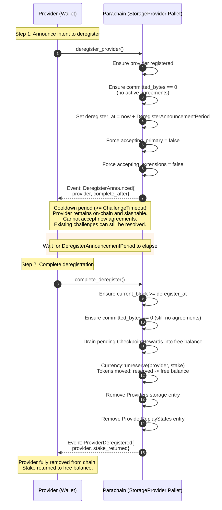
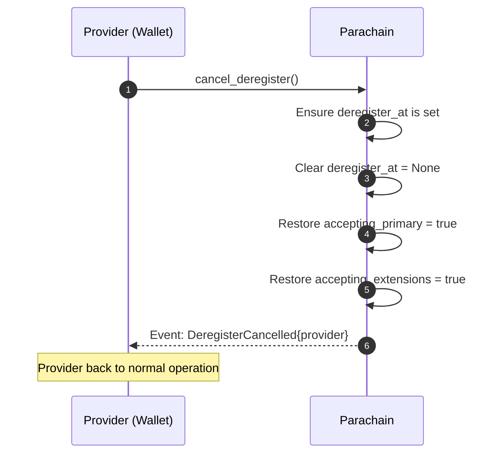

# Provider Deregistration (Two-Step Exit)

Providers cannot exit instantly — a cooldown period (>= `ChallengeTimeout`, default 48h) ensures any pending challenges can still be resolved. The provider remains on-chain and slashable during the wait.

## Deregistration Flow

## Cancellation Flow

A provider can cancel the deregistration at any time before completing it.

## Why Two Steps?

The cooldown period exists for security:

1. **Challenge resolution**: Any client who has challenged the provider needs time for the challenge to be resolved. If providers could exit instantly, they could dodge slashing by deregistering before the challenge deadline.
2. **DeregisterAnnouncementPeriod >= ChallengeTimeout**: This guarantee ensures that any challenge created before the announcement will have its deadline expire before the provider can withdraw stake.
3. **Provider remains slashable**: During the cooldown, the provider's stake is still reserved and can be slashed by `on_finalize` if a challenge expires without response.

## Preconditions

| Check | Error |
|-------|-------|
| Provider must be registered | `ProviderNotFound` |
| `committed_bytes == 0` (no active agreements) | `ProviderHasActiveAgreements` |
| `deregister_at` not already set (for announce) | `DeregisterAnnounced` |
| `deregister_at` is set (for complete/cancel) | `DeregisterNotAnnounced` |
| `current_block >= deregister_at` (for complete) | `DeregisterPeriodNotElapsed` |

## Events

| Event | When |
|-------|------|
| `DeregisterAnnounced { provider, complete_after }` | Cooldown begins |
| `DeregisterCancelled { provider }` | Provider cancels exit |
| `ProviderDeregistered { provider, stake_returned }` | Stake returned, provider removed |
