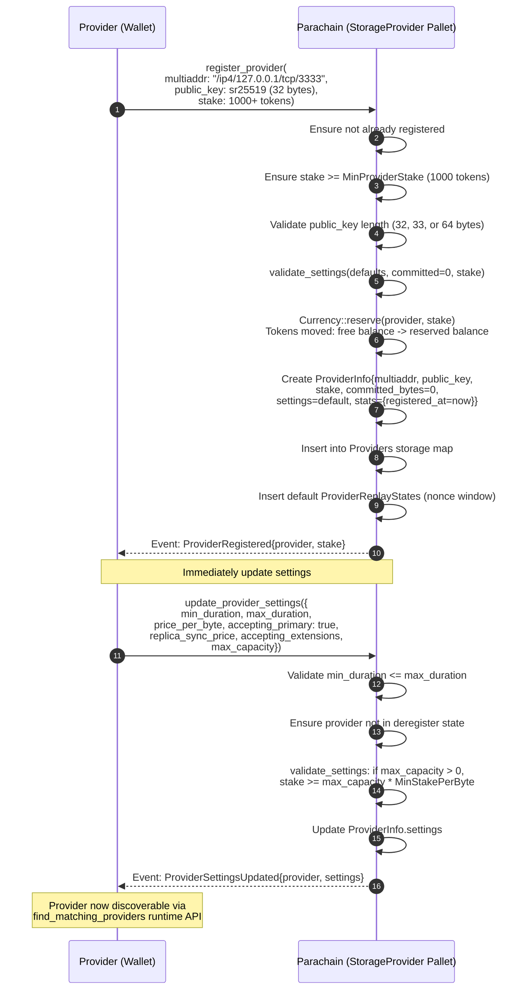
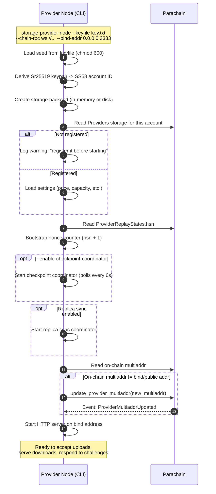
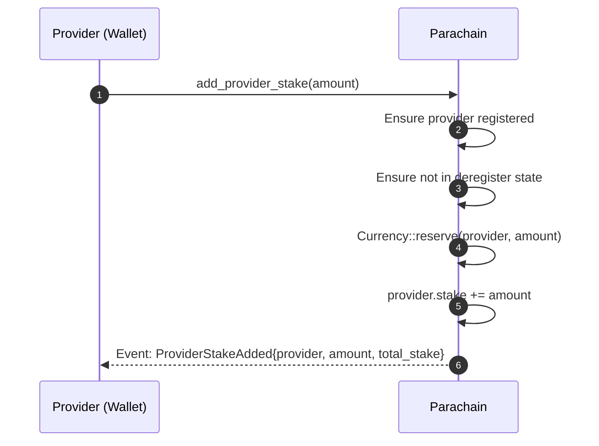

# Provider Registration

End-to-end flow from the provider UI wizard through on-chain registration, settings configuration, and provider node startup.

## 1. On-Chain Registration (Two Transactions)



## 2. Provider Node Startup



## 3. Adding Stake



## Key Types

### ProviderInfo (on-chain)

| Field | Type | Description |
|-------|------|-------------|
| `multiaddr` | `BoundedVec<u8>` | Network address, e.g. `/ip4/127.0.0.1/tcp/3333` |
| `public_key` | `BoundedVec<u8, 64>` | Sr25519 (32b), Ed25519 (32b), or Ecdsa (33/64b) |
| `stake` | `Balance` | Locked collateral |
| `committed_bytes` | `u64` | Sum of `max_bytes` across active agreements |
| `settings` | `ProviderSettings` | Pricing and availability config |
| `stats` | `ProviderStats` | On-chain reputation metrics |
| `deregister_at` | `Option<BlockNumber>` | Set during two-step exit |

### ProviderSettings

| Field | Default | Description |
|-------|---------|-------------|
| `min_duration` | 0 | Minimum agreement duration (blocks) |
| `max_duration` | MAX | Maximum agreement duration (blocks) |
| `price_per_byte` | 0 | Price per byte per block |
| `accepting_primary` | true | Accepting new primary agreements |
| `replica_sync_price` | None | None = not accepting replicas |
| `accepting_extensions` | true | Accepting agreement extensions |
| `max_capacity` | 0 | 0 = unlimited |

### Stake Requirements

```
MinProviderStake = 1000 tokens (absolute minimum)
MinStakePerByte  = 1000 units per byte of declared capacity

Required stake = max(MinProviderStake, max_capacity * MinStakePerByte)
```

If `max_capacity = 0` (unlimited), only `MinProviderStake` applies.

## Storage Items Created

| Storage Item | Key | Value |
|-------------|-----|-------|
| `Providers` | `AccountId` | `ProviderInfo { multiaddr, public_key, stake, settings, stats, ... }` |
| `ProviderReplayStates` | `AccountId` | `ReplayWindow` (nonce sliding window for agreement signing) |

## Events

| Event | When |
|-------|------|
| `ProviderRegistered { provider, stake }` | Registration succeeds |
| `ProviderSettingsUpdated { provider, settings }` | Settings changed |
| `ProviderMultiaddrUpdated { provider }` | Network address changed |
| `ProviderStakeAdded { provider, amount, total_stake }` | Additional stake locked |
