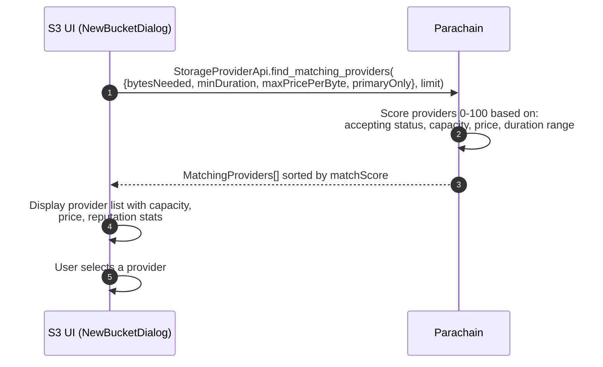
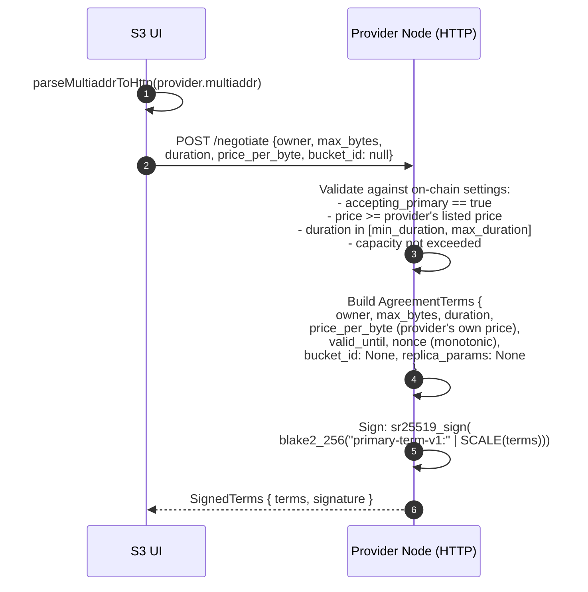
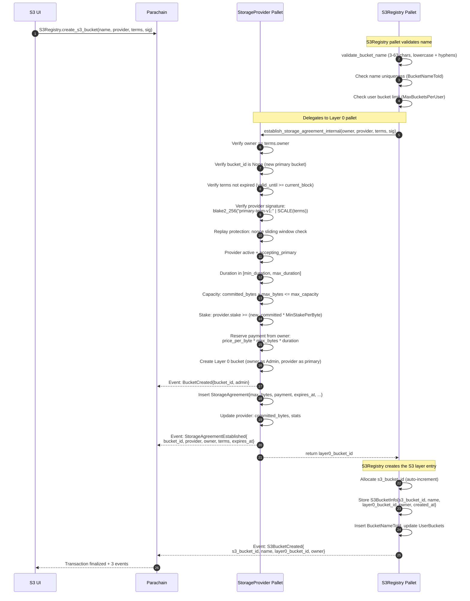
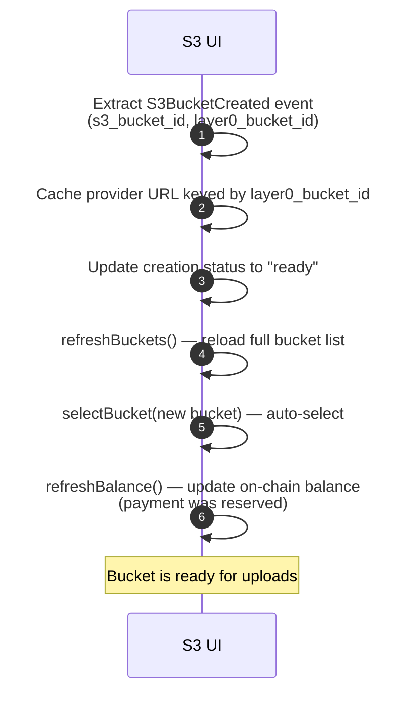

# S3 Bucket Creation

End-to-end flow from the UI through off-chain negotiation to a single atomic on-chain extrinsic that creates a Layer 0 bucket, a storage agreement, and an S3 registry entry.

## 1. Provider Discovery



## 2. Off-Chain Negotiation



## 3. On-Chain Submission (Single Atomic Extrinsic)



## 4. UI Completion



## Events Emitted (in order)

A successful `create_s3_bucket` extrinsic emits three events:

| # | Pallet | Event | Key Fields |
|---|--------|-------|------------|
| 1 | `StorageProvider` | `BucketCreated` | `bucket_id`, `admin` |
| 2 | `StorageProvider` | `StorageAgreementEstablished` | `bucket_id`, `provider`, `owner`, `terms`, `expires_at` |
| 3 | `S3Registry` | `S3BucketCreated` | `s3_bucket_id`, `name`, `layer0_bucket_id`, `owner` |

## On-Chain Storage Created

| Pallet | Storage Item | Key | Value |
|--------|-------------|-----|-------|
| `StorageProvider` | `Buckets` | `bucket_id` | `Bucket { members, primary_providers, snapshot, ... }` |
| `StorageProvider` | `MemberBuckets` | `account_id` | `BoundedVec<BucketId>` |
| `StorageProvider` | `StorageAgreements` | `(bucket_id, provider)` | `StorageAgreement { max_bytes, payment_locked, expires_at, ... }` |
| `StorageProvider` | `Providers` | `provider` | Updated `committed_bytes` and `stats` |
| `StorageProvider` | `ProviderReplayStates` | `provider` | Nonce window advanced |
| `S3Registry` | `S3Buckets` | `s3_bucket_id` | `S3BucketInfo { name, layer0_bucket_id, owner, ... }` |
| `S3Registry` | `BucketNameToId` | `name` | `s3_bucket_id` |
| `S3Registry` | `UserBuckets` | `account_id` | `BoundedVec<S3BucketId>` |
| `S3Registry` | `NextS3BucketId` | (value) | Incremented by 1 |

## Payment Calculation

```
payment = price_per_byte * max_bytes * duration
```

The payment is reserved (locked) from the owner's account at bucket creation time. The provider's listed `price_per_byte` is used (set during negotiation, not the client's proposed price).

## Replay Protection

The provider allocates a monotonic nonce for each negotiation. On-chain, a sliding window (`ProviderReplayState`) tracks used nonces. This prevents replay attacks where a stale `SignedTerms` could be submitted again.
