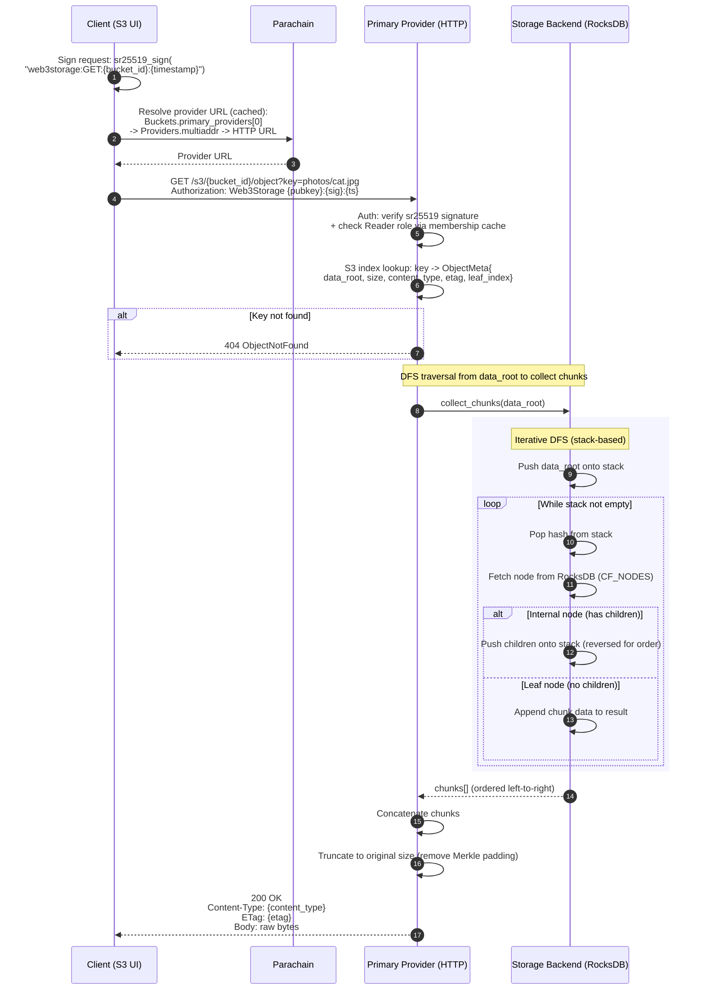
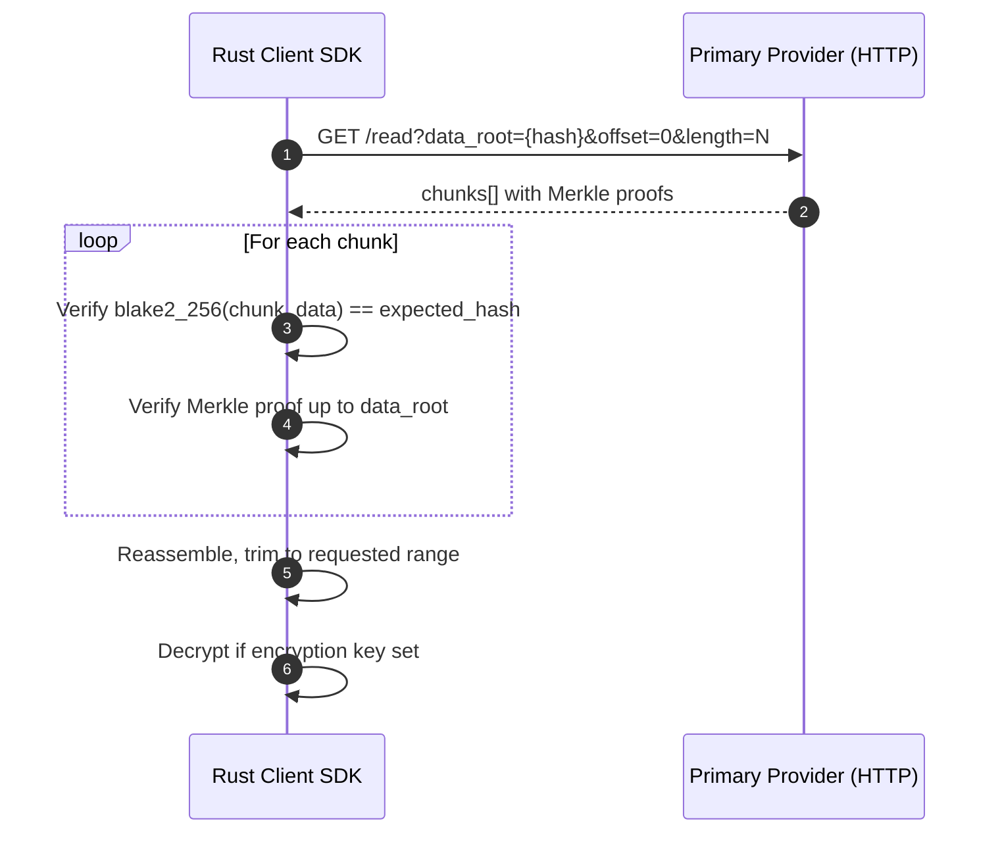
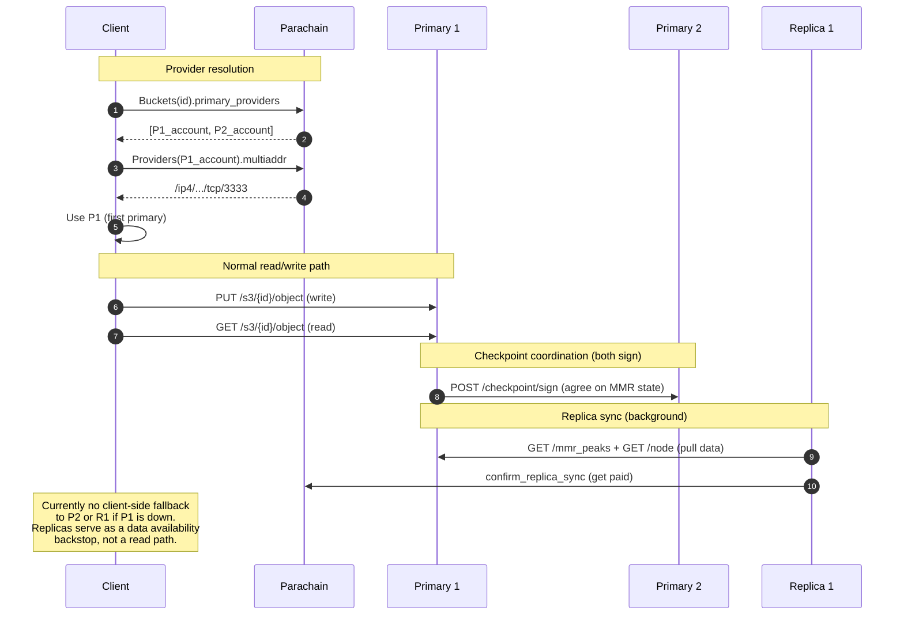

# S3 Read Flow (getObject)

End-to-end flow from the client requesting an object through provider URL resolution, authorization, Merkle tree traversal, and data reassembly.

## Read Flow

## Rust Client (Layer 0) — Verified Download

The Rust SDK downloads with chunk-level verification, unlike the S3 API which trusts the provider.

## How Multiple Providers Serve the Same Bucket

## Key Differences: S3 API vs Layer 0 API

| Aspect | S3 API (TypeScript) | Layer 0 API (Rust) |
|--------|--------------------|--------------------|
| Upload | Single PUT request (auto-chunks, auto-commits) | Multi-step: upload chunks, build tree, commit separately |
| Download | Returns raw bytes | Returns chunks with Merkle proofs |
| Verification | Trusts provider | Client verifies each chunk hash |
| Provider resolution | Dynamic from chain (cached) | Static URL list in config |
| Encryption | Done in client state layer before upload | Built into SDK with `ChunkingStrategy` |
