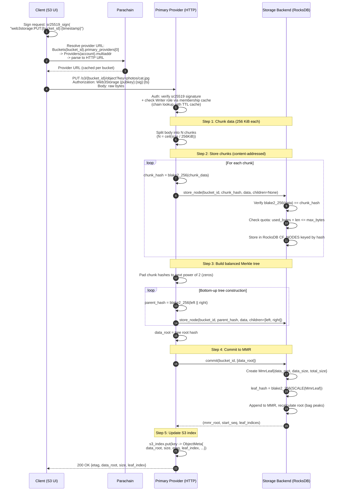
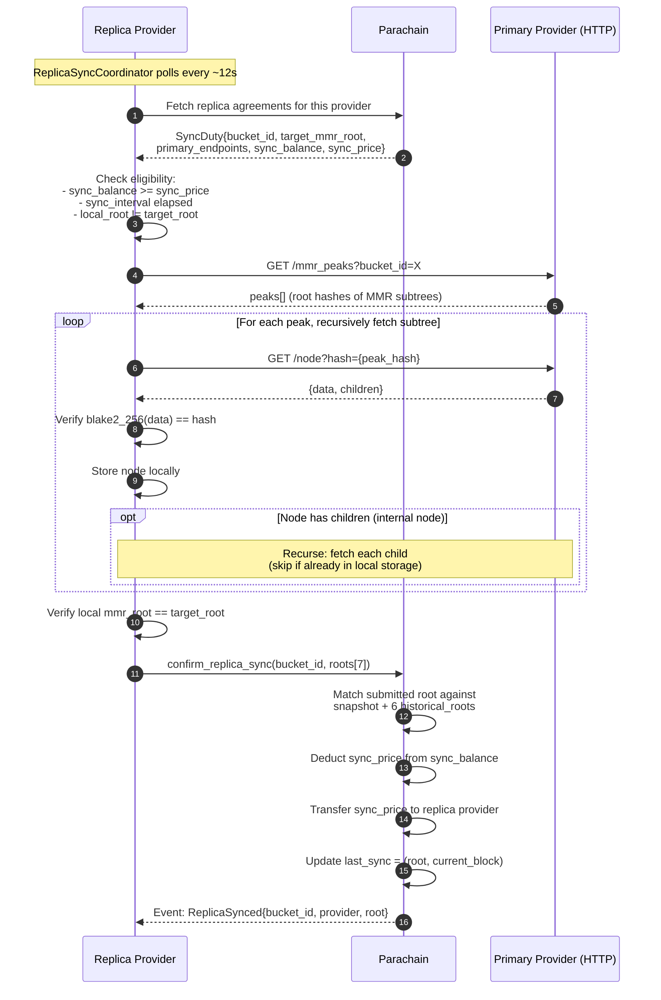

# S3 Write Flow (putObject)

End-to-end flow from the client uploading an object through chunking, Merkle tree construction, and MMR commit on the primary provider, followed by replica sync.

## 1. Client Upload to Primary Provider



## 2. Replica Sync (Background)

After the primary stores data, replicas pull it autonomously.



## Data Structure: From Object to MMR

```
Object (raw bytes)
  |
  v
Chunks (256 KiB each, content-addressed by blake2_256)
  [chunk_0] [chunk_1] [chunk_2] [chunk_3] ...
       \       /           \       /
        \     /             \     /
  Balanced Merkle Tree (padded to power of 2)
         [internal]       [internal]
              \               /
               \             /
              data_root (H256)
                    |
                    v
              MmrLeaf { data_root, data_size, total_size }
                    |
                    v
              leaf_hash = blake2_256(SCALE(MmrLeaf))
                    |
                    v
              MMR (append-only, peaks bagged into mmr_root)
```

## Provider URL Resolution

The client resolves which provider to talk to by reading on-chain state:

```
bucket.primary_providers[0]     (AccountId from Buckets storage)
  -> provider.multiaddr          (from Providers storage)
  -> parseMultiaddrToUrl()        (/ip4/127.0.0.1/tcp/3333 -> http://127.0.0.1:3333)
```

Result is cached per bucket. Currently, the client always talks to the **first primary provider** — there is no fallback to replicas on the read/write path.

## Authorization

Requests are signed with sr25519:

```
Authorization: Web3Storage <pubkey_hex>:<signature_hex>:<timestamp>
Signed message: "web3storage:<METHOD>:<bucket_id>:<timestamp>"
```

The provider verifies the signature, resolves the account's role from on-chain bucket membership (cached with TTL), and checks:

| Operation | Required Role |
|-----------|--------------|
| PUT (write) | Writer or Admin |
| GET (read) | Reader, Writer, or Admin |
| DELETE | Writer or Admin |
